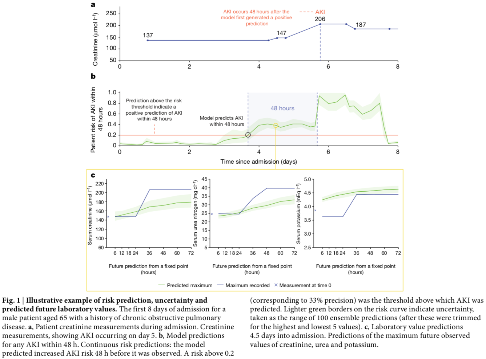
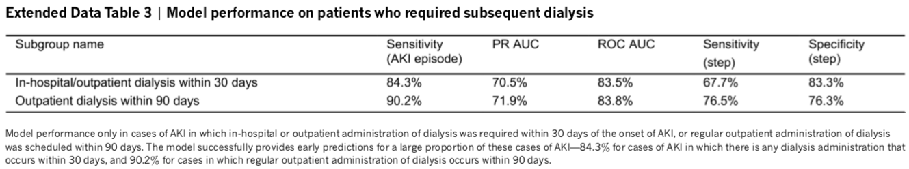
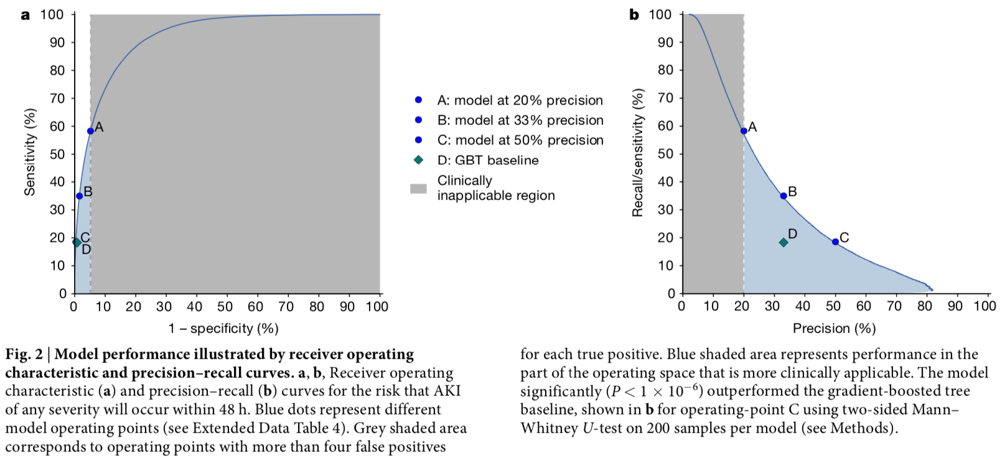
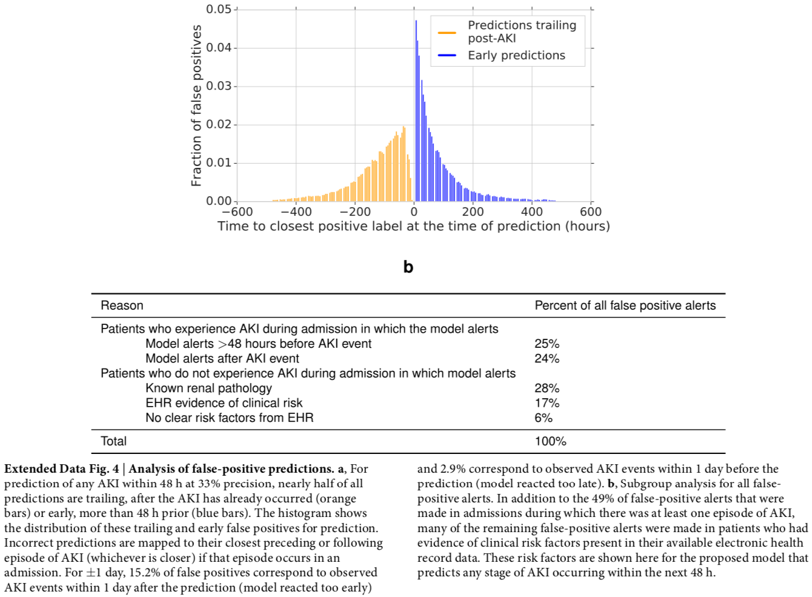
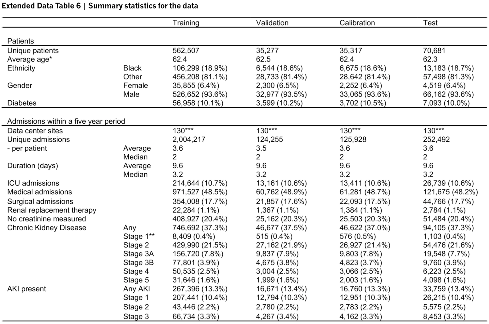
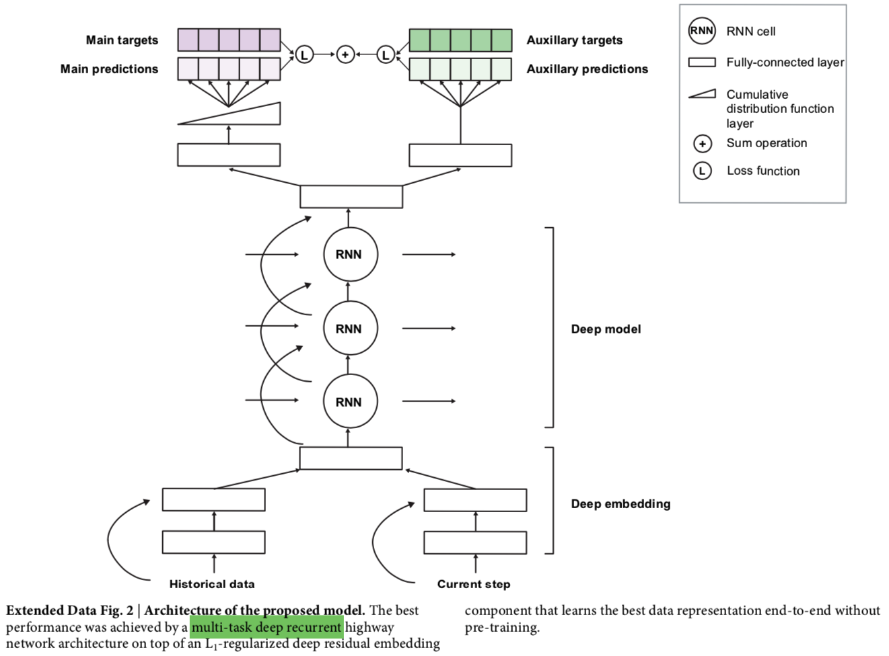

# A clinically applicable approach to continuous prediction of future acute kidney injury

题目：一种临床可应用的持续预测未来急性肾损伤的方法  
摘要：The early prediction of deterioration could have an important role in supporting healthcare professionals, as an estimated 11% of deaths in hospital follow a failure to promptly recognize and treat deteriorating patients1. 
   To achieve this goal requires predictions of patient risk that are continuously updated and accurate, and delivered at an individual level with sufficient context and enough time to act. 
   Here we develop a deep learning approach for the continuous risk prediction of future deterioration in patients, building on recent work that models adverse events from electronic health records2–17 and using acute kidney injury—a common and potentially life-threatening condition18—as an exemplar. 
   Our model was developed on a large, longitudinal dataset of electronic health records that cover diverse clinical environments, comprising 703,782 adult patients across 172 inpatient and 1,062 outpatient sites. 
   Our model predicts 55.8% of all inpatient episodes of acute kidney injury, and 90.2% of all acute kidney injuries that required subsequent administration of dialysis, with a lead time of up to 48 h and a ratio of 2 false alerts for every true alert. 
   In addition to predicting future acute kidney injury, our model provides confidence assessments and a list of the clinical features that are most salient to each prediction, alongside predicted future trajectories for clinically relevant blood tests9. 
   Although the recognition and prompt treatment of acute kidney injury is known to be challenging, our approach may offer opportunities for identifying patients at risk within a time window that enables early treatment.  

文章提出了一种深度学习方法，来进行持续的患者病情恶化风险预测。 
本文提出的模型是基于一个大型的EHR数据集，包括了703,782成年病人，来自172个住院和1062个门诊场所。
模型能够预测急性肾损伤案例中的55.8%，以及90.2%的需要后续透析的急性肾损伤案例，可以提前48小时给出预测，误报的比例为：1个真阳性/2个假阳性。  
## 1. 概述  
文中提出的系统是基于循环神经网络（RNN）的，以单个EHR记录为单位，一次处理一个记录，建立起对相关信息的内部记忆，跟踪直到该时间点的病情信息。  
```text
Our proposed system is a recurrent neural network that operates sequentially over individual electronic health records, processing the data one step at a time and building an internal memory that keeps track of relevant information seen up to that point. 
```
在每一个时间点上，模型都会输出一个未来48小时内发生任意程度AKI的预测概率
（模型也可以扩展到其他的时间窗口或其他严重程度），当预测的概率超出了一个特定的阈值，预测就被认为是阳性的。
```text
At each time point, the model outputs a probability of AKI occurring at any stage of severity within the next 48 h 
(although our approach can be extended to other time windows or severities of AKI; see Extended Data Table 1). 
When the predicted probability exceeds a specified operating-point threshold, the prediction is considered positive.
```
模型使用的训练数据来自一个包含703782名成人数据的数据集，来自US Department of Veterans Affairs（退伍军人事务部门）。
数据集中的独立记录的个数大约为60亿，包括了**62万个特征**。  
```text
The total number of independent entries in the dataset was approximately 6 billion, includ- ing 620,000 features. 
```
数据集被划分为4个部分：训练集（80%），验证集（5%），校准集（5%）以及测试集（10%）。  

```text
Patients were randomized across training (80%), validation (5%), calibration (5%) and test (10%) sets
```
在时间序列中的每一个时间点上，都根据KDIGO规范给出了正确标记，KDIGO的AKI发病率约为13.4%。
```text
A ground-truth label for the presence of AKI at any given point in time was added using the internationally accepted ‘Kidney Disease: Improving Global Outcomes’ (KDIGO) criteria18; 
the incidence of KDIGO AKI was 13.4% of admissions.
```
图1展示了模型的使用。在入院后的每一个时间点上，模型都会提供未来出现AKI的风险估计，以及对应的不确定性等级。
与预测值一起提供不确定度有助于医师区分不同的病例。


使用本文提出的方法，55.8%的入院AKI事件（任意严重程度）都会被提早预测，至多可以提前48小时。
每一个正确的预测会伴随两个错误的预测，对应的AUROC(Area Under the Receiver Operating Characteristic)为92.1%.
而AUPR（Area Under the Precision–Recall）为29.7%。

```text
With our approach, 55.8% of inpatient AKI events of any severity were predicted early, 
within a window of up to 48 h in advance and with a ratio of 2 false predictions for every true positive. 
```
灵敏度（sensitivity，真阳性率，召回率）在由于AKI而发展出长期并发症的患者中非常高。
在30天内由于任何阶段的AKI导致需要入院或门诊进行透析的病人中，模型提供正确的早期预测的比例为84.3%。而在90天内需要进行透析的病人中，预测准确率为90.2%
```text
Sensitivity was particularly high in patients who went on to develop lasting complications as a result of AKI. 
The model provided correct early predictions in 84.3% of episodes in which administration of in-hospital or outpatient dialysis was required within 30 days of the onset of AKI of any stage, 
and in 90.2% of cases in which regular outpatient administration of dialysis was scheduled within 90 days of the onset of AKI (Extended Data Table 3). 
```


模型性能的ROC AUC曲线以及PR AUC曲线如下图所示：  


文章提出的方法能够显著超越作为对比的基线模型. 
基线模型使用梯度提升树模型构建，使用的是人工挑选的、与建模肾脏功能以及开展治疗相关的特征，
此外还结合了一些聚合统计特征。一共为基线模型提供了3599个特征。作为对比，基线模型能够监测到36.0%的AKI事件，而文章提出的模型能够检测55.8%. 
```text
Our approach significantly outperformed (P < 0.001) established state-of-the-art baseline models (Supplementary Information, section D).
For example, we implemented a baseline model with gradient-boosted trees using manually curated features that are known to be relevant for modelling kidney function and in the delivery of routine care (Supplementary Information, sections E and F), 
combined with aggregate statistical information on trends observed in the recent history of the patient. This yielded 3,599 clinically relevant features that were provided to the baseline at each step (Methods). For the same level of precision, this baseline model was able to detect 36.0% of all episodes of AKI in inpatients up to 48 h in advance, compared to 55.8% for our model.
```

对于假阳性的分析：
在模型给出的假阳性报警中，
有24.9%是早于48小时时间窗口的正确的预测（即病人在超过48小时的时间窗口后出现AKI，或者换句话来说，预测结果给出的过早）。
在剩余的假阳性报警中，24.1%是滞后的预测，即晚于AKI事件的发生时间的预测，在临床应用中，可以直接过滤掉这些报警。
对于那些预测风险为阳性但后续又没有AKI被观察到的警报，有可能在很多有AKI风险的病人身上已经应用了适当的预防措施，从而避免了AKI的发生。
除了上述的提早或滞后的预测外，88%的假阳性发生在已经具有严重肾损伤的病人身上。

```text
Of the false-positive alerts made by our model, 
24.9% were positive predictions that were made even earlier than the 48-h window in patients who subsequently developed AKI (Extended Data Fig. 4). 
Of these, 57.1% occurred in patients with pre-existing chronic kidney disease, who are at a higher risk of developing AKI. 
Of the remaining false-positive alerts, 24.1% were trailing predictions that occurred after an AKI episode appeared to have resolved; 
alerts such as these can be filtered out in clinical practice. 
For positive risk predictions in which no AKI was subsequently observed (in this retrospective dataset), 
it is probable that many occurred in patients at risk of AKI to whom appropriate preventative treatment was administered—which would have averted subsequent AKI. 
In addition to these early and trailing predictions, 88% of the remaining false-positive alerts occurred in patients with severe renal impairment, 
known renal pathology or evidence in the electronic health record that the patient required clinical review (Extended Data Fig. 4).
```

论文中所使用的数据集中病人的分布是**不均衡**的，数据集中所有病人中女性只占6.38%，模型的性能表现也差一些。
此外，KDIGO作为判断AKI的指标，在初始的肾功能损伤出现后，有较长时间的滞后，改进AKI的定义，有助于提高模型的性能表现。
```text
KDIGO is an indicator of AKI that has a long lag time after the initial renal impairment, 
and model performance could be enhanced by improvements in the ground-truth definition of AKI and in data quality.
```
## 2. 方法
### 2.1 数据
所选取的数据来自美国退伍军人事务部，管理着1243个医疗机构，其中包括了172个退伍军人事务医疗中心以及1062个门诊机构。
所选取的数据是由所有年龄在18-90岁之间，从2011年10月起到2015年9月止有入院经历，
并且在入院之前至少有1年的电子病例记录的患者组成的。
选取的数据，包括医疗记录，范围最广可以到入院前10年和入院后2年。
```text
The data included medical records with entries up to ten years before each admission date and up to two years afterwards, where available. 
```
数据包括门诊访问（outpatient visits），入院（admissions），诊断（ICD9代码），治疗（CPT代码），
实验室检查结果，药品和处方，orders，生命体征，health factors and note titles。
非常罕见的诊断和文本（在数据库中至少出现一次的不同的患者数少于12个的，即罕见病），被排除在外，
从而确保隐私保护。
此外，较为敏感的健康状况，如HIV/AIDS，性病，药物滥用，精神疾病等也都被排除。
```text
Where available in the US Department of Veterans Affairs database, 
data included outpatient visits, admissions, 
diagnoses as International Statistical Classification of Diseases and Related Health Problems (ICD9) codes, 
procedures as Current Procedural Terminology (CPT) codes, 
laboratory results (including—but not limited to—biochemistry, haematology, cytology, toxicology, microbiology and histopathology), 
medications and prescriptions, orders, vital signs, health factors and note titles. 
Free text and diagnoses that were rare (fewer than 12 distinct patients with at least 1 occurrence in the US Department of Veterans Affairs database) 
were excluded to ensure all potential privacy concerns were addressed. 
In addition, conditions that were considered sensitive were excluded before transfer, 
such as patients with HIV/AIDS, sexually transmitted diseases, 
substance abuse and those admitted to mental health services.
```
最终的数据集包含所有满足上述条件的患者数据，包括了703,782（70万）名患者。
提供了6,352,945,637（63亿）条临床记录。其中39亿条为门诊记录，余下的24亿条为住院记录。
```text
The final dataset consisted of all eligible patients following this set of inclusion criteria, 
and comprised 703,782 patients, which provided 6,352,945,637 clinical-event entries.
Each clinical entry denoted a single procedure, laboratory test result, prescription, diagnosis and so on:
 3,958,637,494 entries came from outpatient events and the remaining 2,394,308,143 events came from admissions.
```


### 2.2 数据预处理-特征的表示

数据集中的每个病人被表示为**事件序列**，每个事件提供的是一个6小时区间内记录的病人信息。
也就是说，每天被划分为4个6小时区间，在每个区间内记录的数据都被合在一起。
6小时窗口内的可用数据，以及额外的统计数据、扩增的数据等，组成了特征集合，用作预测模型的输入。
```text
Every patient in the dataset was represented by a sequence of events, 
with each event providing the patient information that was recorded within a six-hour period; 
that is, each day was broken into four six-hour periods and all records that occurred within the same six-hour period were grouped together. 
The available data within these six-hour windows, along with additional summary statistics and augmentations, 
formed a feature set that was used as input to our predictive models. 
Extended Data Figure 1 provides a diagrammatic view of a patient sequence and its temporal structure.
```

本文中，对缺失的数字值没有进行插值处理，因为对EHR记录来说，对缺失值进行插值并不总能改进模型性能。
代替的，为每个数字值搭配了一个或多个离散的"presence"特征，帮助模型区分缺失的数字值和实际的0值。
此外，这些presence特征还编码了一个特定的数字值是正常、偏低、偏高、非常低或是非常高这些信息。

所有的数字特征都被**正则化**到[0, 1]区间，并且去除了最小（1%）和最大（99%）的极端值。

每一个临床特征都被映射到一个相应的高级概念上，
如procedure, diagnosis, prescription, laboratory test, vital sign, admission, 
transfer等等。 总的来说，数据集中一共有29个这样的高级概念。
在每一个step，在这个step内发生的这些概念的频率直方图将被提供给模型，伴随的还有数字和二元presence特征。

```text
Each clinical feature was mapped onto a corresponding high-level concept, 
such as procedure, diagnosis, prescription, laboratory test, vital sign, 
admission, transfer and so on. In total, 29 such high-level concepts were present in the data. 
At each step, a histogram of the frequencies of these concepts among the clinical entries that took place at that step was provided to the models, 
along with the numerical and binary presence features.
```

**每个患者的年龄（以天数表示）**，以及数据发生时所处的6小时区间，也被作为特征提供给模型。
```text
In addition, we provided some simple features that made it easier for the models to predict the risk of developing AKI. 
In particular, we provided the median yearly creatinine baseline and the minimum 48-h creatinine baseline as additional numerical features. 
These are the baseline values that are used in the KDIGO criteria and help to give important context to the models 
regarding how to interpret new serum creatinine measurements as they become available.
```

计算并提供了3个历史聚合特征表示，一个是过去48小时，一个是过去6个月，一个是过去5年。

```text
We additionally computed 3 historical aggregate feature representations at each step:
 one for the past 48 h, 
 one for the past 6 months and
 one for the past 5 years. 
```

对于离散特征，历史聚合是他们是否在对应的历史时间区间内被观察到；
对于数字特征，计算在区间内观察到的频次，平均，中位数，标准差，最小和最大值，
以及简单的趋势特征如最后一次观察值和最小、最大或平均值的差值。
```text
We did this historical aggregation for discrete features by
 including whether these features were observed in the historical interval or not. 
For numerical features, we included the count, mean, median, standard deviation, 
minimum and maximum value observed in the interval, as well as simple trend features such as 
the difference between the last observed value and the minimum or maximum and the average difference between subsequent steps 
(which measures the temporal short-term variability of the measurement). 
```
所有数据项中，大概35%的数据项只记录了日期而没有记录具体的时间。
对事件序列中的每一天，将这些不知道具体时间的数据项聚合到一个特定的桶中，放在这一天的末尾。
```text
For about 35% of all entries, the day—but not the specific time during the day—on which they occurred was known.
For each day in the sequence of events, we aggregated these unknown-time entries into a specific bucket 
that was appended to the end of the day. 
```
模型只会对一天中的4个有明确时间范围的6小时区间做出预测，模型可以迭代地访问这些信息（没有明确时间的信息），
同时又不会有泄漏来自未来的信息的可能。模型不可以在这第五个没有明确时间范围的数据上做预测，
模型只能在下一个时间点，也就是后一天的第一个时间区间上，使用这些信息。
```text
This ensured that our models could iterate over this information without potentially leaking information from the future. 
Our models were not allowed to make predictions from these surrogate points and they were not factored into the evaluation. 
The models can use the information contained within the surrogate points on the next time step, 
corresponding to the first interval of the following day.
```
数据中的诊断信息有时是在实际的临床诊断做出之前的时间点就被记录在电子病例中的。
为了避免向模型泄露未来的信息，将所有的诊断信息移动到每一次入院的时间末尾，
并且只在那个时间向模型提供这些信息，模型会在处理未来的入院时考虑这些信息。
```text
Diagnoses in the data are sometimes known to be recorded in the electronic health record before the time when an actual diagnosis was made clinically. 
To avoid leaking future information to the models, we shifted all of the diagnoses within each admission to the very end of that admission and only provided them to the models at that point, 
at which time they can be factored in for future admissions. 
```
### 2.3 AKI预测模型
文中提出的预测系统，顺序地处理EHR。在每个时间点，输入特征被提供给模型，输出的是一个概率值，
表示任意严重程度的AKI在未来48小时内发生的可能性。如果概率值超过一个特定阈值，
就会做出阳性的预测，触发一个警报。下图展示的是模型的结构。
首先会将输入特征转换为向量表示，使用的是一个embedding module。
得到的嵌入会被输入到预测模块，将会提供在未来发生AKI的概率。
整个模型是**端到端**训练的，不需要预训练单个模块。
```text
Extended Data Figure 2 gives a schematic view of our model, 
which makes predictions by first transforming the input features using an embedding module. 
This embedding is fed into a multi-layer recurrent neural network, 
the output of which at every time point is fed into a prediction module that provides 
the probability of future AKI at the time horizon for which the model will be trained. 
The entire model can be trained end-to-end; 
that is, the parameters can be learned jointly without pre-training any parts of the model. 
```
训练了预测器的集成，来估计模型的置信度。
```text
To provide useful predictions, we train an ensemble of predictors to estimate the confidence of the model, 
and the resulting ensemble predictions are then calibrated using isotonic regression to reflect the frequency of observed outcomes.
```


* 嵌入模块

使用了带有残差连接的多层感知机模型，ReLU激活函数，使用了L1正则化。

```text
We use a deep multilayer perceptron with residual connections and rectified-linear activations. 
We use L1 regularization on the embedding parameters to prevent overfitting and to ensure that our model focuses on the most-salient features. 
We compared simpler linear transformations, which did not perform as well as the multi-layer version we used. 
We also compared unsupervised approaches such as factor analysis, 
standard auto-encoders and variational auto-encoders, but did not find any substantial advantages in using these methods.
```

* 循环神经网络核心
使用了多层的Recurrent Highway Networks，对比了很多其他的循环网络模型，
没有能够在性能上超越当前选择的网络结构的。
```text
We use a stacked multiple-layer recurrent network with highway connections between each layer34, 
which at each time step takes the embedding vector as an input. 
We use the simple recurrent unit network as the RNN architecture, with tanh activations. 
We chose this from a broad range of alternative RNN architectures: specifically, the long short-term memory35, update gate RNN and intersection RNN36, 
simple recurrent units37,38, gated recurrent units39, the neural Turing machine40, memory-augmented neural network41, 
the Differentiable Neural Computer42 and the relational memory core43. 
These alternatives did not provide significant performance improvements over the simple recurrent unit architecture (Supplementary Information section D).
```

* 预测与训练目标

RNN的输出被交给一个最终的预测层，能够给出所有8个未来时间窗口上的预测结果（从6小时一直到72小时时间窗口）。
使用交叉熵损失函数。
除了预测AKI之外，还做出了一些额外的数字预测任务，即预测未来一个时间段内能够观察到的实验室检验结果的最大值。

```text
We also make a set of auxiliary numerical predictions; 
at each step, we also predict the maximum future observed value of a set of laboratory tests 
over the same set of time intervals as we use to make the future AKI predictions. 
```
也就是说，论文中使用了**多任务学习**方法。实现了更好的泛化和更加健壮的表示，尤其在数据存在类型不均衡的情况下。
使用多任务学习的整体性能提升大约在3% PR AUC。
```text
This multi-task approach results in better generalization and more-robust representations, 
especially under class imbalance
```
整体的损失函数是交叉熵损失函数（AKI预测）和平方损失函数（7个实验室检验结果预测）的加权和。

* 训练与超参数
```text
All variables are initialized via normalized (Xavier) initialization and trained using the Adam optimization scheme. 
We use exponential learning-rate decay during training. 
The best validation results were achieved using an initial learning rate of 0.001 decayed every 12,000 training steps by a factor of 0.85, 
with a batch size of 128 and a back-propagation through time window of 128. 
The embedding layer is of size 400 for each of the numerical and presence input features (800 in total when concatenated) and uses 2 layers. 
The best-performing RNN architecture used a cell size of 200 units per layer and 3 layers.
```
