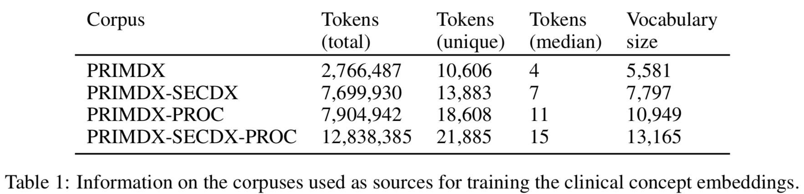
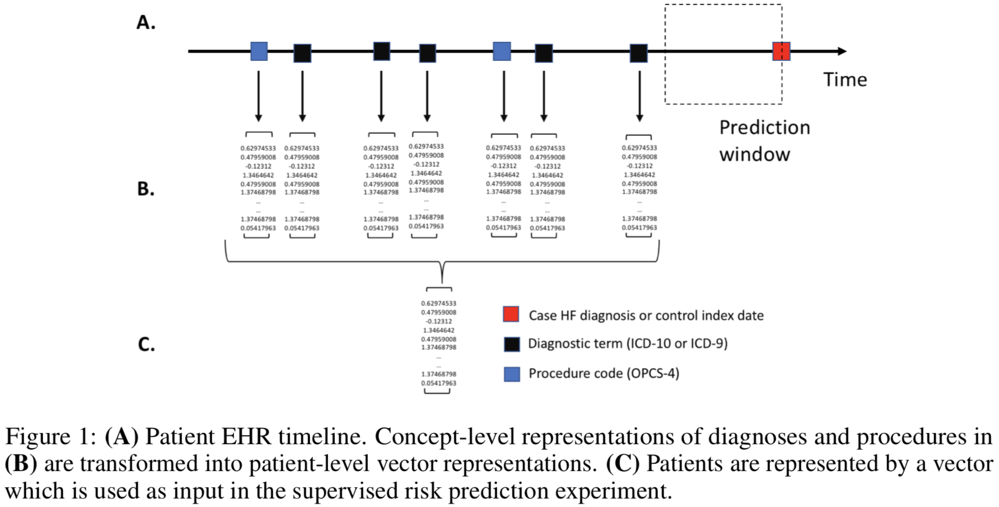
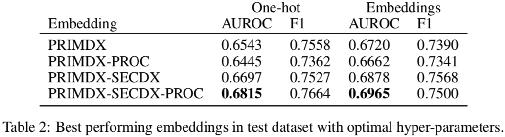

# Application of Clinical Concept Embeddings for Heart Failure Prediction in UK EHR data

题目：临床概念嵌入在英国EHR数据心衰预测中的应用  
摘要：
EHR正越来越多地被用来构建疾病的风险预测模型。Electronic health records (EHR) are increasingly being used for constructing disease risk prediction models.   
然而，由于EHR数据的高维、异构特性，EHR数据中的特征工程是非常具有挑战性的。Feature engineering in EHR data however is challenging due to their highly dimensional and heterogeneous nature.  
EHR数据的低维表示有望缓解这些问题。Low-dimensional representations of EHR data can potentially mitigate these challenges.  
本文中使用了英国国家EHR数据，包含270万入院记录和1300万本体词汇，在此数据集基础上，使用GloVe来学习诊断及治疗的词嵌入。In this paper, we use global vectors (GloVe) to learn word embeddings for diagnoses and procedures recorded using 13 million ontology terms across 2.7 million hospitalisations in national UK EHR.  
作者将学习到的词嵌入用于识别具有较高心衰入院风险的病人，以此展示了这些词嵌入的实用性。
We demonstrate the utility of these embeddings by evaluating their performance in identifying patients which are at higher risk of being hospitalized for congestive heart failure.  
文章最终得出结论，词嵌入可以用于创建健壮的EHR驱动的疾病风险预测模型，并可以解决手工临床特征工程面临的很多限制。
Our findings indicate that embeddings can enable the creation of robust EHR-derived disease risk prediction models and address some the limitations associated with manual clinical feature engineering.  

## 1. 方法
### 1.1 数据源和数据规模

使用了来自UK Biobank的二级医疗（secondary care）EHR数据。Biobank包含了来自英国的50多万个个人数据。 数据集中的诊断（diagnoses）和治疗(procedures)都使用受控的临床术语表来记录。 
We used secondary care EHR from the UK Biobank, a population-based research study comprising 502,629 individuals in the UK. The study contains extensive phenotypic and genotypic information and longitudinal follow-up for health-related outcomes is through linkages to national EHR from hospital care and mortality registers. Diagnoses and procedures were recorded using controlled clinical terminologies, i.e. hierarchical ontologies enables clinicians to systematically record information about a patient’s health and treatment and enable the subsequent use of data for reimbursement [25, 26] and research [27, 28].   
诊断(diagnoses)使用ICD-9和ICD-10来记录，而治疗手段(procedures)使用OPCS-4来记录。入院的病人被赋予了一个主要的和至多15个次要的病因。  
Diagnoses were recorded using ICD-9 and ICD-10 [29] and procedures using OPCS-4 [30]. Admitted patients are assigned a primary and up to 15 secondary causes of admission.  
注：OPCS-4(OPCS Classification of Interventions and Procedures version 4)是一个用于NHS医疗体系（包括英格兰、苏格兰、威尔士）和北爱尔兰的治疗分类体系。

区分了incident和prevalent心衰病例（发病vs患病？）。使用ICD-9和ICD-10来进行HF病例的识别，取入院时年龄在40-85之间的患者。排除了prevalent的病例。
We defined incident and prevalent HF cases using a previously-validated phenotyping algorithm from the CALIBER resource [31, 32, 33]. HF cases were identified using ICD-9 and ICD-10 terms occurring at any position during a patient admission (i.e. primary or otherwise) in patients aged 40-85 years old at the time of admission. We excluded prevalent HF cases from our analyses.   

### 1.2 概念和患者嵌入的学习

作者创建了四个语料库，见表1所示。在这四个语料库上使用GLoVe模型学习了**概念层面**上的嵌入，分别评估了不同的词嵌入维度（50, 100, 150, 250, 500, 1000）和窗口大小(50, 10, 20)。  

We created four corpuses (Table 1) using: a) primary diagnosis terms (PRIMDX), b) primary diagnosis terms and procedure terms (PRIMDX-PROC), c) using primary and secondary diagnosis terms (PRIMDX-SECDX) and, d) primary and secondary diagnosis terms and procedure terms (PRIMDX-SECDX-PROC). We learned concept-level embeddings using the GLoVe model on the four corpuses and evaluated combinations of embedding dimension (50, 100, 150, 250, 500, 1000) and window sizes (50, 10, 20). 



作者也创建了**患者层面**的嵌入，如图1所示。所使用的方法是：a) 从患者的EHR记录中抽取所有词汇; b) 查找每个词汇的向量表示; c) 创造一个向量，由所有概念的向量表示的平均、最大和最小值组成; d) 将所有向量正则化到0平均值以及单位方差的范围内。

We created **patient-level embeddings** (Figure 1.) by: a) extracting all terms from a patients EHR record from the start of follow up to six months (to exclude features very strongly correlated with a subsequent diagnosis [35]) prior to date of HF diagnoses for cases or the index date for matched controls, b) looking up the vector representations for each embedding, c) creating a vector composed of the mean,max and min of all concept vector representations and, d) normalizing to zero mean and unit variance. For comparisons purposes, we additionally created one-hot representations of EHR data where the feature vector had the same size as the entire vocabulary and only one dimension is on.



### 1.3 风险预测

通过应用支持向量机分类器和训练的患者层面的正则化的嵌入来预测HF发病，从而评估嵌入的质量。将数据区分为训练集和测试集（3:1），执行了6折交叉验证。评估预测性能使用了AUROC和F1分数。

We evaluated each set embeddings by applying a linear support vector machine (SVM) classifier to predict HF onset as a supervised binary classification task using the normalized patient-level embeddings as input. We split the data into a training dataset and a test dataset (ratio 3:1) and performed six-fold cross-validation in all modeling iterations on the training data to find the optimal hyper-parameters. We evaluated predictive performance using the area under the weighted receiver operating characteristic curve (AUROC) and the weighted F1 score computed on the test dataset which was unseen.

## 2. 实验结果

使用了来自502639名患者的原始EHR数据，提取了4581个HF病例（其中30.52%是女性）。训练的临床概念嵌入包含了2447个ICD-9，10527个ICD-10，6887个OPCS-4概念，来自2779598次（277万）入院记录。

与one-hot词向量对比，本文提出的词嵌入只是**稍微好一点**，如下图所示。



与其他相关工作相比，本文的结果只是性能相近，甚至还略微弱于其他工作的结果。

```Choi [16] et al. utilized clinical concept vectors trained using *word2vec* skip-gram and reported an AUROC of 0.711 with one-hot encoded input and AUROC of 0.743 using embeddings with a SVM classifier. Interestingly, the fact that we observed similar (albeit slightly worse) results when using data from multiple hospitals compared to a study sourcing data from a single hospital indicates that embedding approaches can potentially be a very useful tool for scaling analyses across large heterogeneous data source and are insensitive to source variations.```

