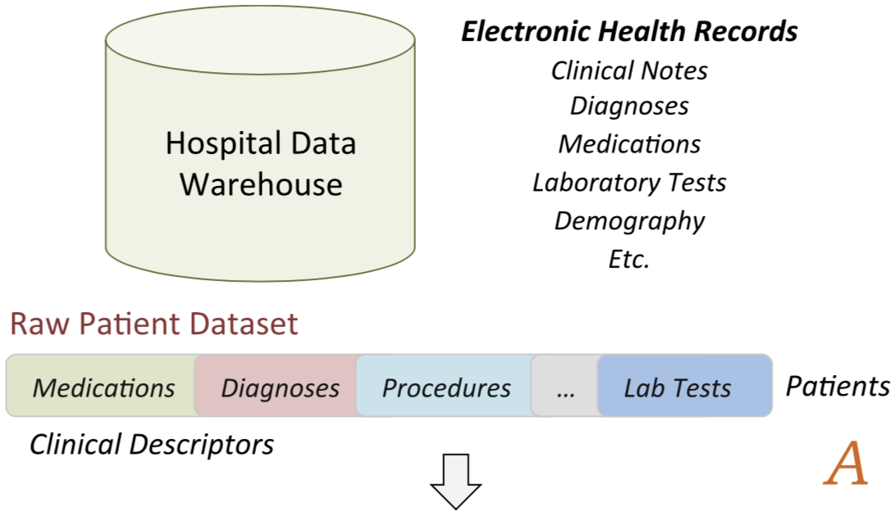
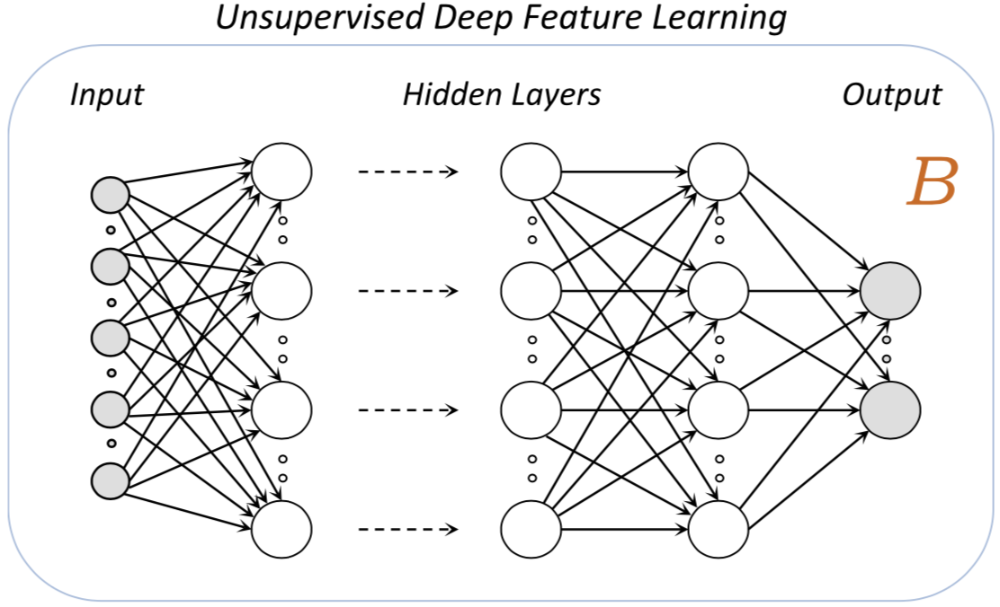
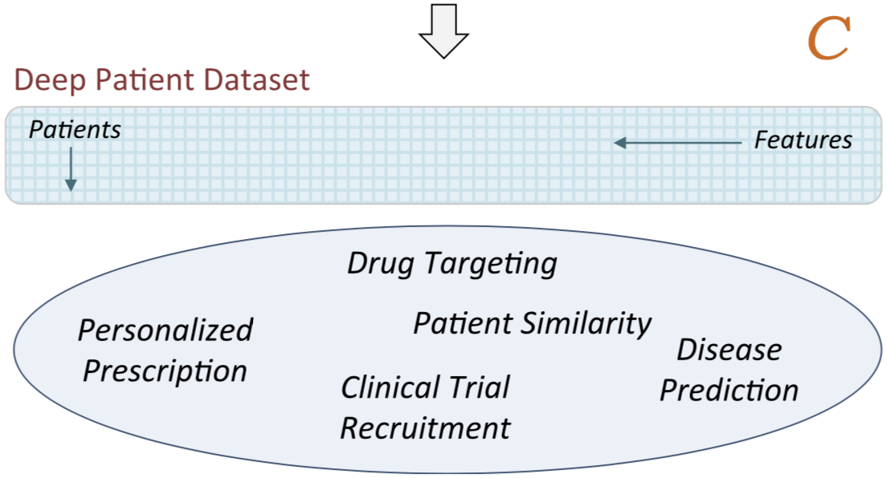
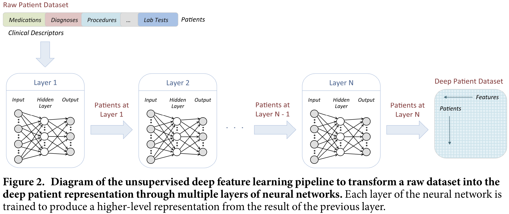
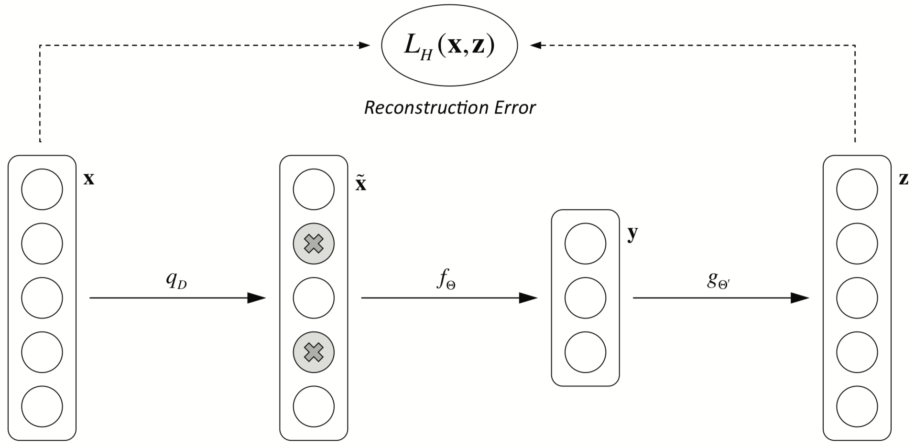
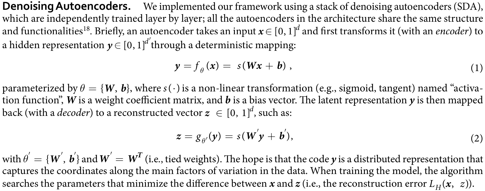
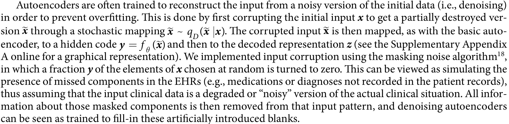
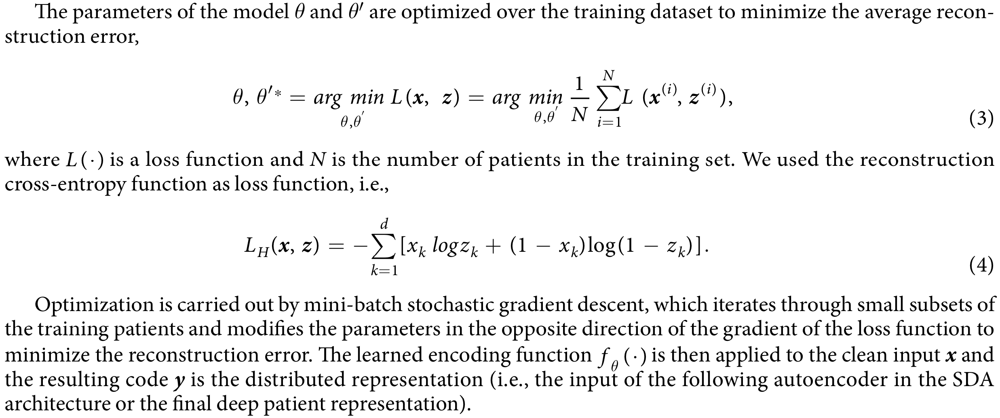
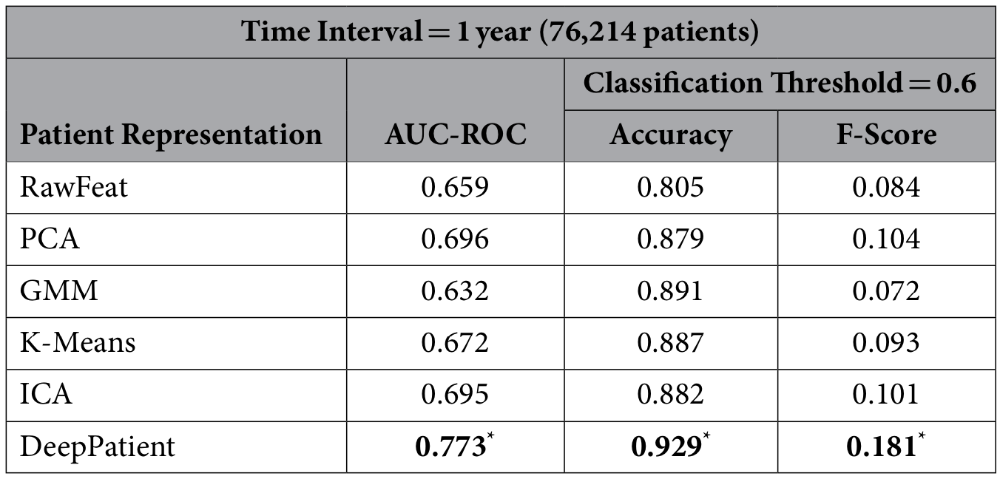
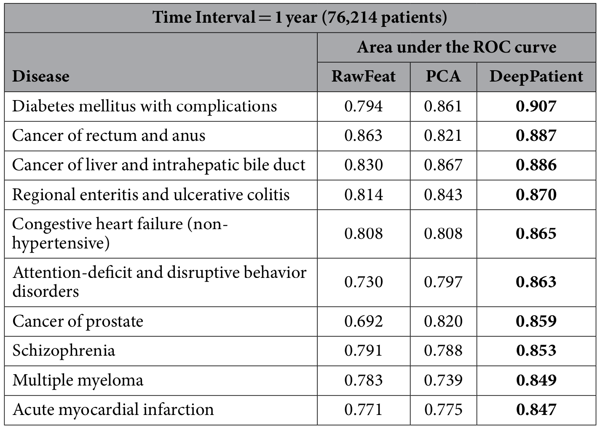

# Deep Patient: An Unsupervised Representation to Predict the Future of Patients from the Electronic Health Records
Deep Patient: 一种从EHR预测患者未来的无监督表示

## 1. 摘要
EHR的二次利用有助于推进临床研究辅助临床决策支持。
在总结和表示患者数据方面的困难，阻碍了使用EHR进行预测建模的广泛应用。
文中提出了一种全新的无监督深度特征学习方法，从EHR中得到通用的患者表示，从而能够促进临床预测建模。
具体来说，使用了三层叠加的dAE(denoising autoencoders)，来捕捉来自70万名患者的EHR中的规律性和依赖关系。
训练结果是被称作"Deep Patient"的表示。通过预测患者患上各种疾病的概率来评估表示。
```text
Secondary use of electronic health records (EHRs) promises to advance clinical research and better inform clinical decision making. 
Challenges in summarizing and representing patient data prevent widespread practice of predictive modeling using EHRs. 
Here we present a novel unsupervised deep feature learning method to derive a general-purpose patient representation from EHR data that facilitates clinical predictive modeling.
In particular, a three-layer stack of denoising autoencoders was used to capture hierarchical regularities and dependencies in the aggregated EHRs of about 700,000 patients from the Mount Sinai data warehouse. 
The result is a representation we name “deep patient”. 
We evaluated this representation as broadly predictive of health states by assessing the probability of patients to develop various diseases. 
We performed evaluation using 76,214 test patients comprising 78 diseases from diverse clinical domains and temporal windows. 
Our results significantly outperformed those achieved using representations based on raw EHR data and alternative feature learning strategies. 
Prediction performance for severe diabetes, schizophrenia, and various cancers were among the top performing. 
These findings indicate that deep learning applied to EHRs can derive patient representations that offer improved clinical predictions, 
and could provide a machine learning framework for augmenting clinical decision systems.
```

## 2.概述
EHR data is challenging to represent and model due to its high dimensionality, noise, heterogeneity, sparseness, incompleteness, random errors, and systematic biases.  
EHR数据具有维度高、噪音大、高度异构性、高稀疏性，不完整、随机错误、系统性地偏差等问题。  

Moreover, the same clinical phenotype can be expressed using different codes and terminologies. 
For example, a patient diagnosed with “type 2 diabetes mellitus” can be identified by laboratory values of hemoglobin A1C greater than 7.0, 
presence of 250.00 ICD-9 code, “type 2 diabetes mellitus” mentioned in the free-text clinical notes, and so on.  
相同的临床phenotype可以在EHR中以不同的代码或术语来表达。  

临床预测算法的成功与否很大程度上依赖于特征的选择和数据的表示。常见的方法是由领域专家来指定数据模式，并指定临床变量。  
The success of predictive algorithms largely depends on feature selection and data representation.  
传统的监督方法存在着可扩展性差、泛化性能差、无法发现新的模式和特征等缺陷。
A common approach with EHRs is to have a domain expert designate the patterns to look for (i.e., the learning task and the targets) and to specify clinical variables in an ad-hoc manner.  

无监督的特征学习尝试克服有监督特征空间定义的缺陷，通过自动识别数据中的模式和依赖，
学习一种紧凑和通用的表示，从而使得构建分类器或预测器时更容易自动抽取有用的信息。
Unsupervised feature learning attempts to overcome limitations of supervised feature space definition 
by automatically identifying patterns and dependencies in the data 
to learn a compact and general representation that 
make it easier to automatically extract useful information when building classifiers or other predictors.  


Deep Patient是领域无关的，不需要人工标注，可以应用在多种监督/无监督预测应用中。
Deep patient is domain free (i.e., not related to any specific task since learned over a large multi-domain dataset), does not require any additional human effort, and can be easily applied to different predictive applications, both supervised and unsupervised.  

## 3.使用的方法和数据
### 3.1 Deep Patient Representation
下面三幅图展示的是提取Deep Patient表示的高层概念框架。  
首先从临床数据仓库中提取出EHR，预处理以识别和正则化临床相关的phenotypes，
整合到患者向量中，这也是患者的原始表示。  
EHRs are first extracted from the clinical data warehouse, 
pre-processed to identify and normalize clinically relevant phenotypes, 
and grouped in patient vectors (i.e., raw representation, Fig. 1A).  



每个患者都可以用一个向量或一组向量序列来表示。
Each patient can be described by just a single vector or by a sequence of vectors computed in, e.g., predefined temporal windows.  
从所有患者的数据中获取的向量集合被作为特征学习算法的输入，来获取高级的表示。
The collection of vectors obtained from all the patients is used as input of the feature learning algorithm to discover a set of high level general descriptors.  

数据仓库中的每个患者都被使用这些特征来表示，这样的深度表示可以应用在不同的临床任务上。
Every patient in the data warehouse is then represented using these features 
and such deep representation can be applied to different clinical tasks.  


在深度学习架构下，使用多层神经网络来导出患者表示。
网络的每一层都被训练输出所观察到的特征的更高层次的表示，而这里观察到的特征是来自于下一层的输出，也是当前层的输入。
每一层输出的表示都比前一层更加抽象。最后一个网络的输出是最终的患者表示。
We derived the patient representation using a multi-layer neural network in a deep learning architecture (i.e., deep patient). 
Each layer of the network is trained to produce a higher-level representation of the observed patterns, 
based on the data it receives as input from the layer below, 
by optimizing a local unsupervised criterion (Fig. 2). 
Every level produces a representation of the input pattern that is more abstract than the previous level because it is obtained by composing more non-linear operations. 
This process is loosely analogous to neuroscience models of cognition that hierarchically combine lower-level features to a unified and compact representation. 
The last network of the chain outputs the final patient representation.  


### 3.2 Denoising Autoencoders


使用堆叠的dAE实现了本文的框架，dAE中的每一层都是独立训练的。架构中的所有自动编码器都具有相同的结构和功能。
We implemented our framework using a stack of denoising autoencoders (SDA), 
which are independently trained layer by layer; 
all the autoencoders in the architecture share the same structure and functionalities.  

使用了交叉熵损失函数(cross-entropy function)，优化使用的是mini-batch SGD（随机梯度下降）。  
自动编码器，带有噪声的自动编码器的原理：  




### 3.3 实验评估方法的设计
使用了Mount Sinai数据仓库中的数据，使用预测病人未来疾病的方式进行评估。
Mount Sinai卫生系统最多可以连续跟踪一个病人长达12年。
Here we used the Mount Sinai data warehouse to learn the deep features and we evaluated them in predicting patient future diseases. 
The Mount Sinai Health System generates a high volume of structured, 
semi-structured and unstructured data as part of its healthcare and clinical operations, 
which include inpatient, outpatient and emergency room visits. 
Patients in the system can have as long as 12 years of follow up unless they moved or changed insurance. 
Electronic records were completely implemented by our health system starting in 2003. 
The data related to patients who visited the hospital prior to 2003 was migrated to the electronic format as well but we may lack certain details of hospital visits (i.e., some diagnoses or medications may not have been recorded or transferred). 

完整的EHR数据集包含420万病人的信息，筛选了1980-2014年间被诊断出疾病（以ICD-9编码表示）的病人的信息，
最终得到的是120万病人的信息。每个病人平均有88.9条记录. 
The entire EHR dataset contains approximately 4.2 million de-identified patients as of March 2015, 
and it was made available for use under IRB approval following HIPAA guidelines. 
We retained all patients with at least one diagnosed disease expressed as numerical ICD-9 between 1980 and 2014, inclusive. 
This led to a dataset of about 1.2 million patients, with every patient having an average of 88.9 records.  

使用了截止2013年12月31日前的34年的数据用作训练，
选取2014年的数据做测试。
Then, we considered all records up to December 31, 2013 (i.e., “split-point”) as training data 
(i.e., 34 years of training information) and all the diagnoses in 2014 as testing data.
### 3.4 EHR数据的处理方法

对每个病人，提取了基本的demographic、clinical descriptors、medications、procedures、 
lab tests以及clinical notes。
For each patient in the dataset, we retained some general demographic details 
(i.e., age, gender and race), and common clinical descriptors available in a structured format 
such as diagnoses (ICD-9 codes), medications, procedures, and lab tests, 
as well as free-text clinical notes recorded before the split-point. 

数据预处理，使用了Open Biomedical Annotator [(OBA)](http://www.bioontology.org/)对文本进行标注，会标记上harmonized codes。 
All the clinical records were pre-processed using the Open Biomedical Annotator to obtain harmonized codes for procedures and lab tests, 
normalized medications based on brand name and dosages, 
and to extract clinical concepts from the free-text notes. 
In particular, the Open Biomedical Annotator and its RESTful API leverages the National Center for Biomedical Ontology (NCBO) BioPortal, 
which provides a large set of ontologies, 
including SNOMED-CT, UMLS and RxNorm, to extract biomedical concepts from text and to provide their normalized and standard versions.  

对于diagnoses, medications, procedures, lab tests, 
简单的对病人的EHR进行计数（正则化之后的编码）。  

The handling of the normalized records differed by data type. 
For diagnoses, medications, procedures and lab tests, 
we simply counted the presence of each normalized code in the patient EHRs, 
aiming to facilitate the modeling of related clinical events.  

对于自由文本的Clinical Notes，首先尝试发现否定标签和家族病史的记录，
Clinical Notes里面出现的否定标签被认为是不相关的，被抛弃了。
使用了[NegEx](https://blulab.chpc.utah.edu/content/contextnegex)来识别否定标签，
与家族病史相关的会被标记出来，与直接的病人相关的标签区分开来。  

Free-text clinical notes required more sophisticated processing. 
We applied the tool described in LePendu et al., 
which allowed identifying the negated tags and those related to family history. 
A tag that appeared as negated in the note was considered not relevant and discarded. 
Negated tags were identified using NegEx, a regular expression algorithm that implements several phrases indicating negation, 
filters out sentences containing phrases that falsely appear to be negation phrases, 
and limits the scope of the negation phrases. 
A tag that was related to family history was just flagged as such and differentiated from the directly patient-related tags. 
We then analyzed similarities in the representation of temporally consecutive notes to remove duplicated information 
(e.g., notes recorded twice by mistake).  

解析后的notes还要进一步处理以减少数据稀疏性，并获取嵌入的临床信息的语义表示。
对解析后的notes使用了**主题模型**建模，将文档表示为主题的多项式。
使用了LDA(latent Dirichlet allocation)作为主题模型的实现，
通过在一百万随机notes上进行perplexity analysis来估计主题的个数。
最终发现300个主题取得了最好的泛化效果，因此每一个note最终被表示为300个主题概率的多项式。
最终，对每个患者，取得了一个单一的基于主题的表示，将所有note的表示平均。  

The parsed notes were further processed to reduce the sparseness of the representation (about 2 million normalized tags were extracted) 
and to obtain a semantic abstraction of the embedded clinical information. 
To this aim we modeled the parsed notes using topic modeling, 
an unsupervised inference process that captures patterns of word co-occurrences within documents to define topics and represent a document as a multinomial over these topics. 
Topic modeling has been applied to generalize clinical notes and improve automatic processing of patients data in several studies. 
We used latent Dirichlet allocation as our implementation of topic modeling and we estimated the number of topics through perplexity analysis over one million random notes. 
We found that 300 topics obtained the best mathematical generalization; therefore, 
each note was eventually summarized as a multinomial of 300 topic probabilities. 
For each patient, we eventually retained one single topic-based representation averaged over all the notes available before the split-point.  

### 3.5 数据集的划分

所有病人的信息被分成三个独立的数据集。
在2014年至少有一个新的ICD-9诊断，并且在之前有至少10条数据记录的病人被保留下来，共81214个病人，
其中5000人作为验证集，76214作为测试集，用于监督验证。  
All patients with at least one recorded ICD-9 code were split in three independent datasets for evaluation purposes 
(i.e., every patient appeared in only one dataset). 
First, we held back 81,214 patients having at least one new ICD-9 diagnosis assigned in 2014 and at least ten records before that. 
These patients composed validation (i.e., 5,000 patients) and test (i.e., 76,214 patients) sets for the supervised evaluation (i.e., future disease prediction). 
In particular, all the diagnoses in 2014 were used to evaluate the predictions computed using the patient data recorded before the split-point 
(i.e., prediction from the patient clinical status). 
The requirement of having at least ten records per patient was set to ensure that each test case had some minimum of clinical history that could lead to reasonable predictions. 
随机选取了20万名病人，具有至少5条记录，用作训练集。
We then randomly sampled a subset of 200,000 different patients with at least five records before the split-point to use as training set for the disease prediction experiment.

对疾病进行了分类，人工去除了一部分与社交行为（HIV）或外部事件（受伤/中毒）有关的疾病或过于宽泛的疾病，最终得到了78种疾病  
We used ICD-9 codes to state the diagnosis of a disease to a patient. 
However, since different codes can refer to the same disease, 
we mapped the codes to a disease categorization structure used at Mount Sinai, 
which groups ICD-9s into a vocabulary of 231 general disease definitions. 
This list was filtered to retain only diseases that had at least 10 training patients 
and manually polished by a practicing physician to remove all the diseases that could not be predicted from the considered EHR labels alone 
because related to social behaviors (e.g., HIV) and external life events (e.g., injuries, poisoning), 
or that were too general (e.g., “other form of cancers”). 
The final vocabulary included 78 diseases, 
which are reported in the Supplementary Appendix B online.

### 3.6 患者表示的学习
自动编码器的隐藏层有500个单元，噪声比例是5%，使用了三层自动编码器，Sigmoid作为激活函数。

## 4.实验结果
使用了两个任务来评估：疾病分类，患者疾病标记
### 4.1 Evaluation by Disease
在疾病层面上评估。通过预测患者是否会在一年时间内，诊断患上某种新的疾病来评估Deep Patient的表示能力。实验结果如下：
  



### 4.2 Evaluation by Patient
在患者层面上评估。

