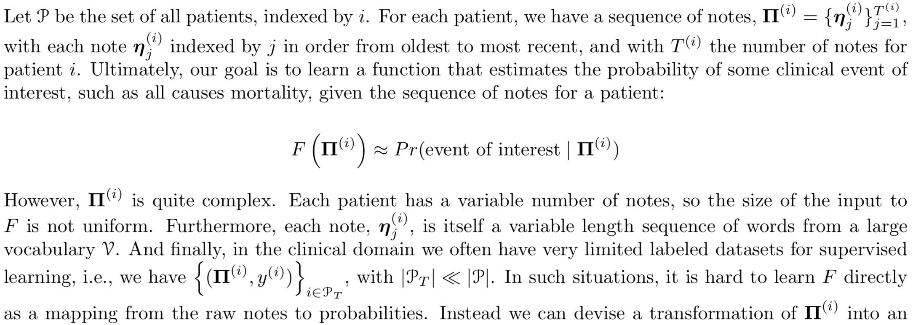
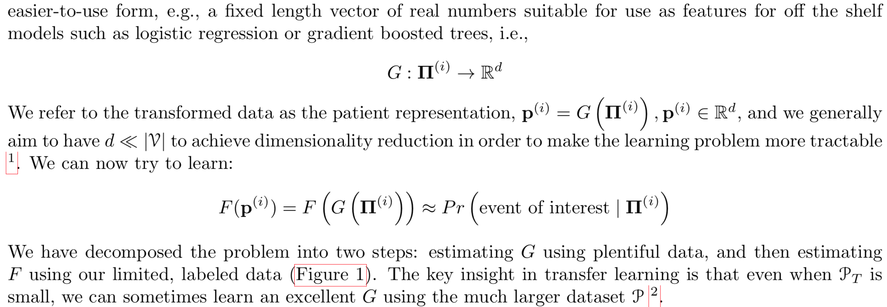
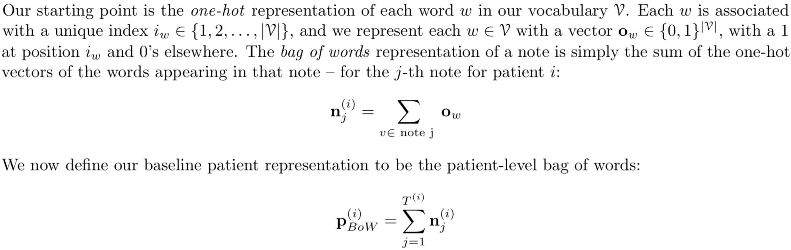
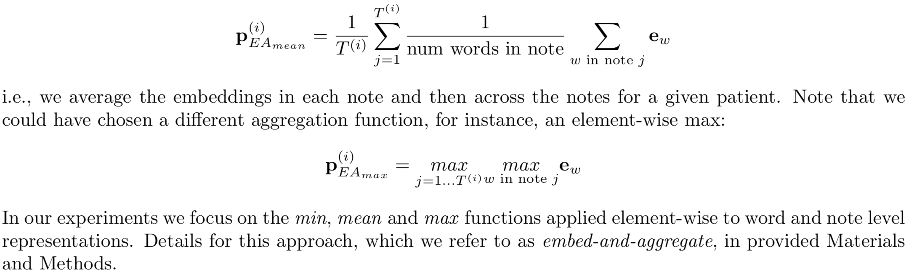
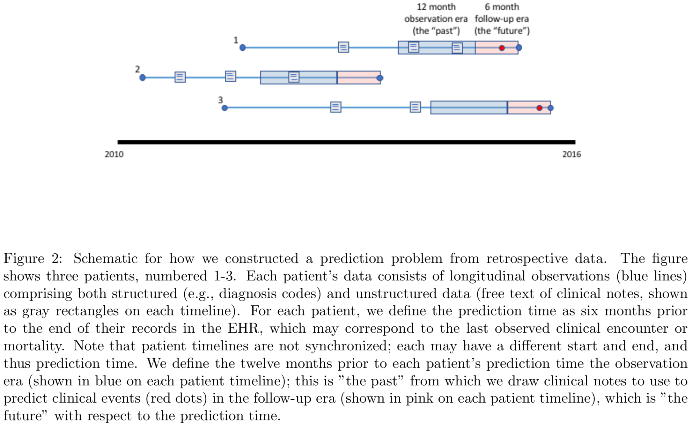
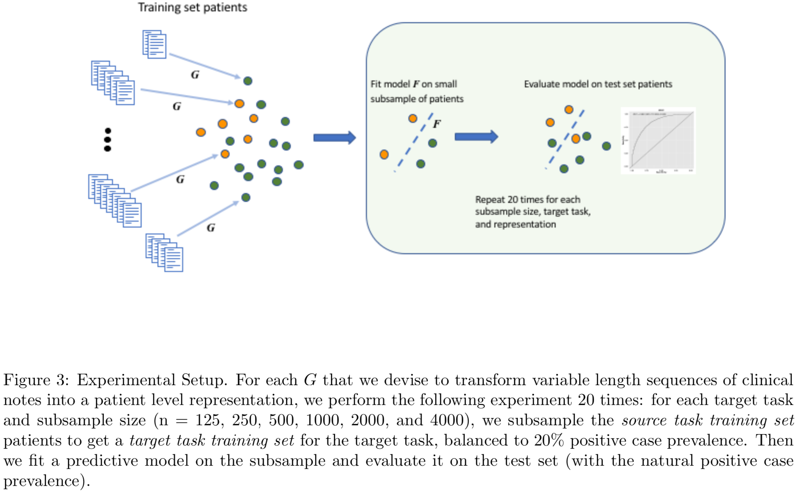
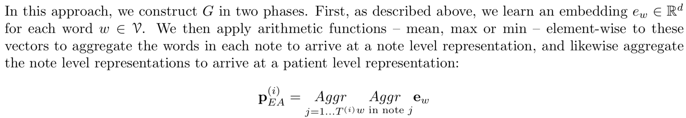
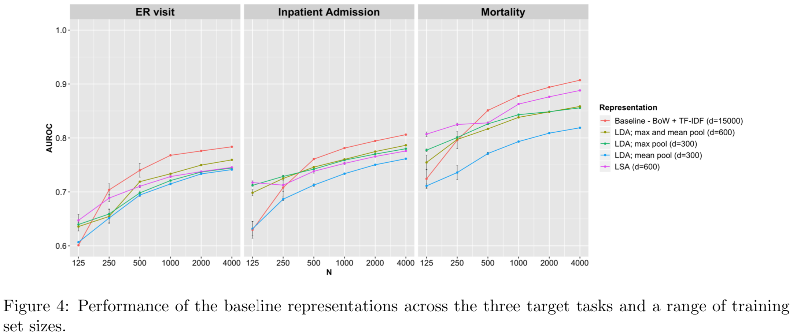
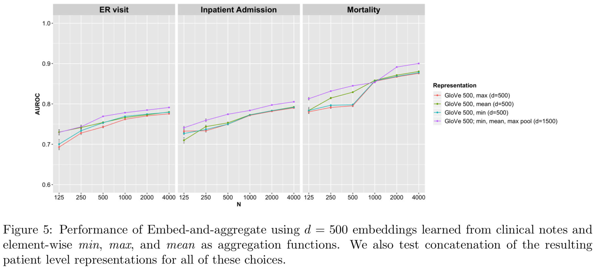
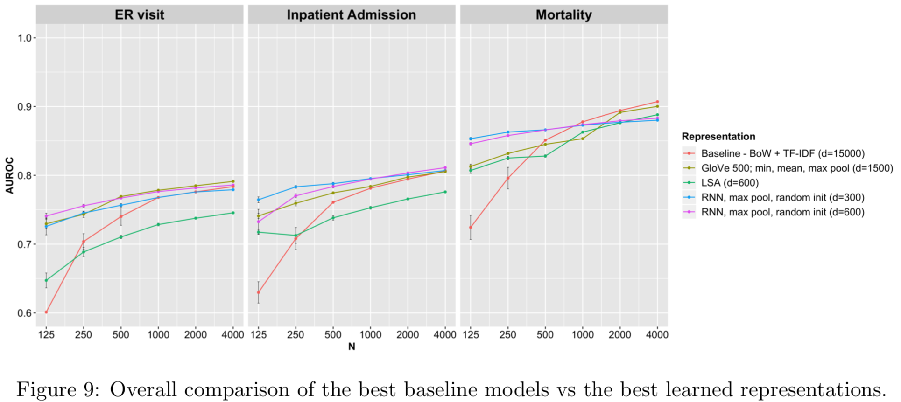

# Efficient Representations of Clinical Text
arXiv文章，题目实际为"Efficient Representations of Clinical Text"。  
题目：临床文本的高效表示  
# 1.摘要
探索使用神经网络和迁移学习（transfer learning）来学习临床记录的表示。
实验数据由270万notes以及11.5万病人组成，来自Stanford Hospital。
使用学到的表示以及常用的词袋模型和主题模型表示作为预测临床事件的模型特征。
实验评估显示，由神经网络模型学习得到的表示要远远好于其他方法。

```text
Clinical notes are a rich source of information about patient state. 
However, using them to predict clinical events with machine learning models is challenging. 
They are very high dimensional, sparse and have complex structure. 
Furthermore, training data is often scarce because it is expensive to obtain reliable labels for many clinical events. 
These difficulties have traditionally been addressed by manual feature engineering encoding task specific domain knowledge. 
We explored the use of neural networks and transfer learning to learn representations of clinical notes that are useful for predicting future clinical events of interest, 
such as all causes mortality, inpatient admissions, and emergency room visits. 
Our data comprised 2.7 million notes and 115 thousand patients at Stanford Hospital. 
We used the learned representations, along with commonly used bag of words and topic model representations, 
as features for predictive models of clinical events. 
We evaluated the effectiveness of these representations with respect to the performance of the models trained on small datasets. 
Models using the neural network derived representations performed significantly better than models using the baseline representations with small (N < 1000) training datasets. 
The learned representations offer significant performance gains over commonly used baseline representations for a range of predictive modeling tasks and cohort sizes, 
offering an effective alternative to task specific feature engineering when plentiful labeled training data is not available.
```

## 2.概述
临床记录（Clinical Notes）中包含了一些很重要的信息，而这些信息是很难在电子病例（EHR）中找到的。
临床记录具有维度高、数据稀疏、包含复杂的语言学和时态结构等问题，给研究人员带来了很大的困难。
更麻烦的是，很多临床应用缺乏可靠的标记，因此如何在缺乏标记数据的情况下，
学到高效的临床记录表示，从而取得较好的预测表现，是本文研究的内容。
传统地，取得这样的表示需要大量人工的特征工程，本文希望以数据驱动的方式，
获取这样的表示，采用的方法是迁移学习（transfer learning）。    

迁移学习解决这一问题的方法是首先在具有大量标注的**"源任务"**上训练一个大规模的、复杂的模型。
得到的模型，在学习如何解决"源任务"的过程中，会学到一个将输入数据转换为一个表示的方法，
而学习到的这个表示可以很好的解决"源任务"。
接下来我们会把这个模型用在只有非常有限数据的目标任务上。
我们希望学习得到的表示在解决目标任务上比起原始输入来说更加有效。
```text
Transfer learning addresses this problem by first training a large, 
complex model on a source task with a large dataset that has abundant labels. 
The resulting model, in the course of learning how to perform the source task, 
learns a transformation of the input data into a useful form, 
i.e., a representation, that allows it to solve the source task well. 
We then use this model on data for a target task with more limited data. 
We hope that the learned representation is more effective for solving the target task than the original, 
raw input.
```
### 2.1 问题描述
  
  
主要问题在于，每个病人的临床记录都是一个序列，不同的病人，序列长度不同；
同时，一个临床记录本身也是一个序列，序列中的词来自于一个可能很大的词汇表V。
并且，在临床领域，通常只有非常少的标注数据集。

### 2.2 词袋模型及其缺点
最简单的表示词的方法是one-hot，使用词袋模型来表示临床记录，就是将记录中的每个词的one-hot向量加起来。
  
词袋模型的问题：保留了one-hot词向量的高维度和稀疏性。
同时，对于语义相近的notes应该具有相似的表示这一直觉特性也不满足。

### 2.3 词袋模型的改进
对基本的词袋模型的改进，有两种经典的方法：Latent Semantic Analysis (LSA)和Topic models（例如：Latent Dirichlet Allocation）。
这两种方法都可以将病人表示的维度大大降低，并且都是无监督的。

### 2.4 临床概念的词嵌入
通过数据驱动的方式，可以学习词的向量表示，如GloVe和Word2Vec；
得到词向量表示后，将一个文档中的词向量相加求平均通常就可以得到一个比较好的文档向量表示。
与此类似地，将note中的概念向量加和求平均，再将一个病人的所有note向量加和求平均，可以得到病人的表示。
  
这种方法，在本文中叫做：embed-and-aggregate

### 2.5 使用RNN进行迁移学习
RNN被广泛应用在建模变长时间序列上，并且也被用在EHR和ICU时间序列上。
但是，前期的工作都是直接为目标任务训练模型的，而在本文中关心的是训练数据非常有限的目标任务。
为此需要使用迁移学习方法，首先在源任务上训练一个RNN，
为了求解源任务，RNN需要学习将变长的输入序列，每个元素是对应于一个特定患者在特定的一天的note的词袋，
转换为一个固定长度的向量，适合于源任务。
转换函数G就是由RNN提供的，接下来将G应用在具有目标任务标注的患者数据上，学习得到F。

## 3. 方法与数据
### 3.1 数据来源
数据来自Stanford Translational Research Integrated Database Environment (STRIDE)。
每个患者的数据由一个encounters的时间序列组成，从2009-2014年。
Encounters包含结构化和非结构化的数据。
结构化数据通常包括来自受控词表的离散的代码，
表示诊断、药物、处理，以及量化的测量值比如生命体征和实验室检查。
非结构化数据包含自由文本临床记录（clinical notes）。
本文的研究关注于clinical notes。
```text
Each patient’s data comprised a timestamped series of encounters with care providers over the five year period. 
Encounters generated both structured and unstructured data. 
The structured data typically consists of discrete codes from controlled vocabularies for diagnoses, medications, and procedures, 
along with quantitative measurements such as vitals and laboratory measurements. 
The unstructured data consists of the free text clinical notes written by care providers documenting each encounter and other aspects of patient care. 
Our study focuses on the use of the clinical notes to predict clinical events.
```
### 3.2 文本处理
简单地说，论文在一个较大地生物医学词表中查找clinical notes中的名词。
与这些名词相关的否定短语和家族史也单独标记。
每个note因此被化简为词袋表示，没有识别为生物医学概念的词都被抛弃了。
每个词被映射到唯一的生物医学概念上，使用了基于UMLS词表的映射方法，
UMLS词表将字符串映射到CUIs（概念唯一标识符）。
```text
Briefly, we find occurrences of terms in an expansive vocabulary of 
biomedical terms compiled from a collection of controlled terminologies and biomedical ontologies.
Each term mention with is also tagged with negation 
(e.g., atrial fibrillation was ruled out) and family history(e.g., The patient’s father had hypertension).
Each note is thus reduced to a bag of words representation, 
and any terms that are not recognized as biomedical concepts are discarded, 
along with the sequence of words appearing in a note. 
Each term is mapped to unique biomedical concepts [LePendu et al., 2013a] 
using a mapping based on the the Unified Medical Language System (UMLS) Metathesaurus, 
which provides a mapping of strings to Concept Unique Identifiers (CUIs) [Bodenreider, 2004]. 
```
论文将否定概念保留为词表中的单独元素。
最终，删除了出现次数少于50个或多于一千万个note的概念，最终的词表包括了107388个概念。
```text
We retained negated concepts as distinct elements in our vocabulary because negative findings may be informative in clinical medicine. 
Finally, we removed concepts that appeared in fewer than 50 or more than 10 million notes. 
This resulted in a final vocabulary of 107,388 concepts.
```
### 3.3 预测时间和数据分割
论文设置预测时间为每个患者记录的结束时间之前6个月，记录的结束是根据最后一个encounter记录或死亡记录来判定的。
在预测时间之前的12个月被称为 observation era, 预测时间之后的6个月被称为 follow-up era。
使用每个患者的observation era内的clinical notes来预测在follow-up era中是否会发生特定的临床事件。
如下图所示：
  
这种对于预测时间的选择，可能会给学习任务带来bias，
因为在现实中显然是不能相对于某个不确定的未来事件（如死亡）来做出预测的。
但是，论文的研究是比较不同的表示clinical notes的策略，所以不受影响。
论文使用的数据，过滤掉在observation era中不包含任何医学概念的notes之后，
还剩下115232个患者，2735647个notes。患者被随机划分为训练集、验证集、测试集，
分别包括69417，11290和34525个患者。
### 3.4 目标任务
六个月死亡率（six month mortality）, 急诊（emergency department visits）, 
住院（inpatient admissions）。
这些目标任务的发生率很低，所以会有明显的类型不平衡，发生率分别是2.8%, 8.5%以及5.1%
```text
These labels are ascertained from patient demographic and encounter data from the EHR. 
Note that these targets are low prevalence, 
so these problems exhibit significant class imbalance – 
the prevelances of the outcomes are 2.8%, 8.5%, and 5.1% respectively.
```
## 4. 实验
### 4.1 实验设置
首先，定义源任务的训练集合是从69417名训练集合患者的observation era的数据。
使用这个数据来学习患者级别的表示，也就是转换函数G。
这些患者的follow-up era的数据**没有**被用来训练函数G。
目标任务训练集合定义为源任务训练集合的随机子集，
并添加了follow-up era中对应的临床事件的标注。
  
论文在采样数据的过程中，使用了stratified sampling

```text
Note that we use stratified sampling to construct the PT with a fixed prevalence of 20% because 
the target task positive cases are quite rare.
```
### 4.2 从临床文本中学习患者层面的表示
#### 4.2.1 方法一：Embed-and-aggregate
将函数G划分为两个阶段：
首先给词表中的每个词学习一个向量表示。
接下来逐元素地对每个note中的每个词应用算数函数-mean, max, min-来将note中的所有词向量聚合为一个note向量。
之后再对患者的所有note应用相同的算法，得到患者的向量表示。
  
在学习词向量的过程中，使用的是GloVe算法，设定的窗口长度是10，迭代25次。
作为对比，还使用了来自于论文"Learning Low-Dimensional Representations of Medical Concepts"中的词向量MCEMJ，
#### 4.2.2 方法二：循环神经网络
在这个方法中，使用的输入是以词向量词袋序列形式表示的clinical notes，关于某个给定的患者，在患者的observation era。
这些向量被按照时间顺序输入给RNN，同一天的notes被合并到一个输入向量中。
RNN的最终隐藏状态被用作患者层面的表示，并用于源任务的训练：预测在observation era期间患者的诊断编码，
```text
In this approach, we use recurrent neural nets whose input is a sequence of bag of words vectors 
representing the clinical notes written about a given patient in that patient’s observation era.
These vectors are input in temporal order to the RNN, 
and notes written on the same day are merged into a single input vector.
The final hidden state is used as the patient level representation for the following source task: 
predict the diagnosis codes assigned to the patient during their observation era. 
```
诊断代码是从每个患者的observation era期间的结构化数据中提取出来的ICD9编码，
根据论文"Doctor AI: Predicting clinical events via recurrent neural networks"中的方法，
利用[CCS数据库](https://www.hcup-us.ahrq.gov/toolssoftware/ccs/ccs.jsp)，
可以将12856个诊断代码映射到254个疾病分类上，例如lung cancer或cardiac dysrhythmias，
可以用来训练RNN。具体的训练参数设置如下：
#### 4.2.3 方法三：基线表示
使用了基于TF-IDF的词袋模型，LSA，LDA表示等方法构建基线表示。
对于TF-IDF词袋模型，限制了词表为15000个最常见单词。
```text
We compared the learned representations against the TF-IDF transformed bag of words (TF-IDF BOW), 
Latent Semantic Analysis (LSA), and Latent Dirichlet Allocation (LDA) representations presented above. 
For TF-IDF BOW, we limited the vocabulary to the 15,000 most frequent words in each training subsample. 
Word counts were then summed over each patient’s input notes. 
The final representation consisted of TF- IDF transformed counts of words for each patient, 
where the term and inverse document frequencies were computed over the entire training corpus 
(i.e., all notes from the observation eras of the training set patients). 
For LSA, we summed the bag of words vectors for all the notes in each training set patient’s observation era, 
and performed a truncated SVD on the resulting term-patient matrix [Ref irlba package]. 
We truncated the SVD to 600 dimensions. 
Finally, for LDA, we fit a topic model on the training corpus using Gensim [Rˇeh ̊uˇrek and Sojka, 2010]. 
300 topics were fit over two passes through the training notes. 
The model was then used to estimate topic distributions for validation and test set notes. 
The topic distributions for each note in a given patient’s observation era were aggregated using mean and max pooling.
```
### 4.3 目标任务模型
目标任务模型使用的是L2正则化的Logistic回归模型，使用各种患者级别表示作为输入。
模型使用了5折交叉验证。

## 5.实验结果
```text
We now present the results of our experiments, 
in which we compare the target task performance of our learned representations against each other and our baseline representations. 
We first focus on results for broad classes of representations before discussing the overall comparison in order to simplify the latter. 
In all experiments, we show three learning curves – estimates of the relationship between generalization performance and target task training set size – for each of the three target tasks of interest and target task training set sizes of ranging from N = 125 to N = 4000. 
The error bars are the standard error of the mean for each estimate across 20 random subsamples of target task training patients as described above.
```

### 5.1 基线表示的表现
  
### 5.2 Embed-and-aggregate方法的表现
可以看到，将min, max, mean三种向量链接起来的效果最好。
  
### 5.3 RNN的表现
对比了LSTM和GRU的效果，最终选择的是GRU+max聚合作为RNN模型架构
RNN在小数据的情况下表现最好，TF-IDF+BOW在数据规模大的时候表现最好。
  
### 5.4 wide+deep表示
将RNN学习得到的向量与TF-IDF+BOW计算得到的向量拼接，得到wide+deep表示。
  
