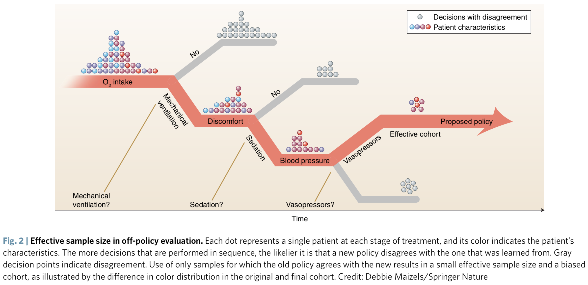

# Guidelines for reinforcement learning in healthcare
题目：在医疗中应用强化学习的指导方针

在医疗领域，强化学习已经被应用在很多方面，如HIV的抗逆转录治疗优化、抗癫痫药物的定制、
败血症的最佳治疗方案的判定等。与一般的AI如一次性的预测不同，强化学习的输出会影响到病人的未来健康和未来治疗选择。
长期的效果会更难以估计。
```text
In the context of healthcare, RL has been applied to optimizing antiretroviral therapy in HIV2, 
tailoring antiepilepsy drugs for seizure control3, 
and determining the best approach to managing sepsis4. 
In contrast with more common uses of AI, such as one-time predictions, 
the output (or the decision) of a RL system affects both the patient’s future health and 
future treatment options5. As a result, long-term effects are harder to estimate (Fig. 1).
```
通过对不同的奖励（rewards）进行权衡，RL算法可以把目标定在短期目标如重新开始自主呼吸，
也可以把目标定在长期目标如避免永久性器官损伤。
```text
By weighing different rewards, 
a RL algorithm could be designed to target short-term outcomes, 
such as liberation from mechanical ventilation,
or longer-term outcomes, such as prevention of permanent organ damage.
```
文中给出了一些在医疗相关的研究中应用强化学习需要注意的问题。包括：
## 1. Is the Ai given access to all variables that influence decision making?
**AI是否能够使用所有对于制定决策有影响的变量？**  
临床医师如果不了解某些关键状况，就无法做出好的决策，AI也一样。
所以如果希望基于历史数据来估计一个新的治疗策略的质量，将所有临床医师会使用到的信息纳入考量是非常重要的。
否则会产生一些由于虚假相关性导致的错误结论。
```text
A clinician could not be expected to make good decisions about a patient’s vasopressor medication dosing 
without knowing about the patient’s comorbid cardiac condition as well as what has transpired in the last 24 hours, 
and neither can an AI. 
To estimate the quality of a new treatment policy based on historical data, 
it is vital to take into account any information that was used by clinicians 
in their decision making - failing to do so may result in estimates that are confounded by spurious correlation.
```
## 2. How big was that big data, really?
**数据规模究竟有多大？**  
当回顾式地评估RL算法地效果时，选择的治疗策略会影响到实际**有效样本**的大小。  
```text
When evaluating the quality of an RL algorithm retrospectively, 
the choice of the proposed treatment policy affects the effective sample size.
```

总的来说，如果学习到的策略与临床医师使用的策略相似，有效样本大小会比较大，
意味着RL对于优化已有治疗方案更加可靠，而不是发现新的治疗方案。
```text
In general, the effective sample size will be larger if the learned policies are close to the clinician policies, 
suggesting that RL with observational data will be most reliable for refining existing practices rather than discovering new treatment approaches.
```
# 3. Will the Ai behave prospectively as intended?
**AI的表现能否具有前瞻性？**  
即使AI能够使用所有重要的变量，算法评估也很完美，问题表达或数据处理中的错误也仍然会导致糟糕的决策。
过于简化的回报函数有可能会因为毫无意义的收益忽略长期效果。
学习得到的策略，在不同的医院或同一家医院的不同时间也有可能无法工作的很好。
```text
Even if the AI had access to all the important variables and the evaluation was perfect, 
errors in problem formulation or data processing can lead to poor decisions. 
Simplistic reward functions may neglect long-term effects for meaningless gains: 
for example, rewarding only blood pressure targets may result in an AI that causes long-term harm by excessive dosing of vasopressors. 
Errors in data recording or preprocessing may introduce errors in the reward signal, 
misleading the RL algorithm. 
Finally, the learned policy may not work well at a different hospital or even in the same hospital a year later if treatment standards shift.
```
