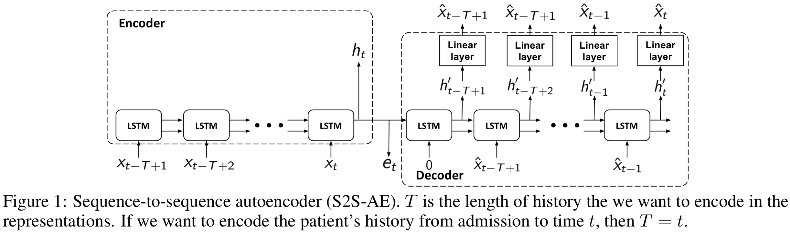
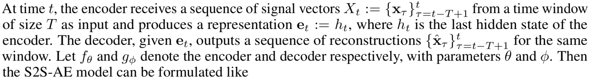
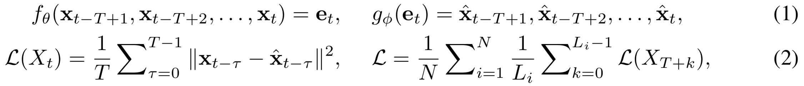
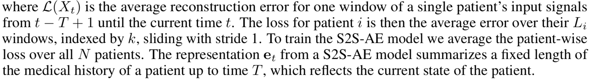
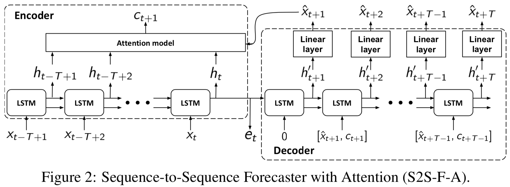
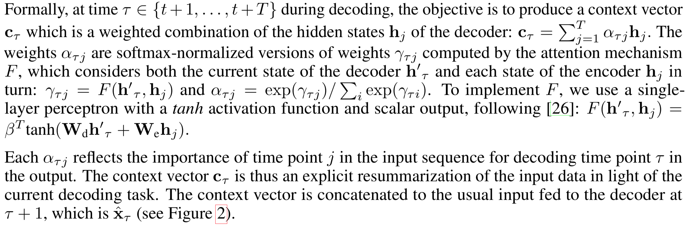
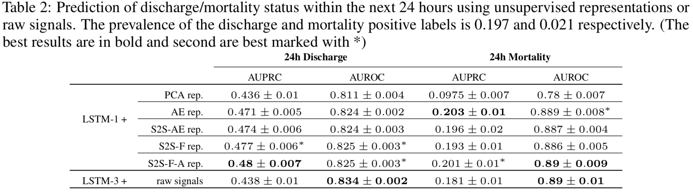

# Improving Clinical Predictions through Unsupervised Time Series Representation Learning  
通过无监督时序表示学习改进临床预测（效果）  

## 1. 摘要
文章研究了在医疗时序数据上的无监督表示学习，具有能够利用海量无监督数据以辅助临床决策支持的潜力。
通过在临床相关结果预测上的评估，文章表名，无监督表示学习相比端到端的监督学习可以提供明显的性能提升。
论文使用了Seq2Seq模型在两种不同的方式下进行实验：自动编码解码器和预测器，
并且实验表明，性能最佳的是**带有注意力机制的预测Seq2Seq模型**。
```text
In this work, we investigate unsupervised representation learning on medical time series, 
which bears the promise of leveraging copious amounts of existing unlabeled data in order to eventually assist clinical decision making. 
By evaluating on the prediction of clinically relevant outcomes, 
we show that in a practical setting, 
unsupervised representation learning can offer clear performance benefits over end-to-end supervised architectures. 
We experiment with using sequence-to-sequence (Seq2Seq) models in two different ways, 
as an autoencoder and as a forecaster, 
and show that the best performance is achieved by a forecasting Seq2Seq model with an integrated attention mechanism, 
proposed here for the first time in the setting of unsupervised learning for medical time series.
```
## 2. 表示学习模型
### 2.1 基线模型：Autoencoder(Seq2Seq)
自动编码、解码器由两步组成：
1）encoding将输入数据空间映射到表示空间上，
且通常有。  
2）decoding完成的工作正相反，从表示空间重构输入数据。 
自动编码解码器的目标是最小化重构数据和输入数据之间的误差。

序列到序列模型（Seq2Seq）。虽然Seq2Seq模型通常是用在监督训练场景下，
通过将最小化输入-重构误差作为目标函数，在本文中以无监督的方式来使用Seq2Seq模型，
这样的模型在本文中被称作S2S-AE。下图展示了模型结构。

在编码器和解码器单元中，都使用了LSTM。S2S-AE模型可以形式化地用下面的公式来表示：  


在时间t，编码器收到一个来自大小为T的时间窗口的信号向量序列作为输入，
产生一个表示，
其中的是编码器的最后一个隐含状态。
而解码器，给定了后，
将输出同样窗口长度的重构序列：。
设和分别表示编码器和解码器，
和是参数

### 2.2 序列预测模型(S2S-F)
假设预测患者时间序列信号中未来的时间点这一要求，会促使编码LSTM提取过去的时间序列中有意义的表示。
出于这一目的，设计了另一个Seq2Seq模型的变种，S2S-F，其中F表示预报，在这一模型中，
解码器预测未来的时间序列而不是重构过去的时间序列。
通过这种方式，学习到的表示仍然反映当前的患者状态，同时也为预测未来患者状态进行了优化。
这种模式下，修改后的解码器和损失函数表示如下：

### 2.3 带有注意力机制的序列预测模型(S2S-F-A)
在时序预测中应用注意力机制背后的想法是帮助解码器在解码过程中有偏好地注意到输入序列中的特定部分，
这使得特定的相关事件，如心率的显著变化，能够更多地对生成输出序列起作用。


## 3. 实验与结果
### 3.1 数据
数据来自于eICU Collaborative Research Database v1.2，
包含了94个时间序列变量，包括周期性和非周期性的生命体征，实验室检验结果等在内的特征被提取出来。
数据按照小时为单位重新采样，剔除了非法数据，对缺失数据做了插值处理。
整体来说，数据集由20878个患者的72-720小时数据历史组成，从ICU入院到出院。
使用的窗口大小为12小时（即12个时间点），表示的维度为94。
### 3.2 重构过去与预测未来
本文提出的模型，有一部分是重构过去的数据（PCA, AE和S2S-AE），有一部分是预测未来的数据（S2S-F and S2S-F-A）
为了比较这些模型，使用这些表示作为输入，输入到一个1层的LSTM，训练来重构过去12小时或预测未来12小时的数据。
可以看到，带有注意力机制的预测模型表现效果最好。
### 3.3 预测未来24小时内的死亡率和出院状态
除了评估学习得到的表示在过去/未来信号预测中的能力之外，作者也使用学习得到的表示来预测其他的临床事件。
这里包括了预测ICU中的病人是否会在未来的24小时内病情稳定并离开ICU，或在未来的24小时内死亡。
使用表示作为输入，训练了1层的LSTM分类器，来预测这两个事件，使用AUROC/AUPRC作为评价手段。  

此外，在原始输入数据的基础上，也训练了一个3层的LSTM作为基线对照模型。