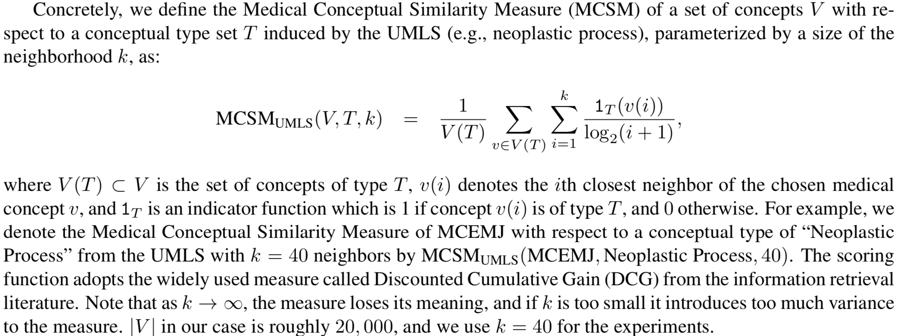
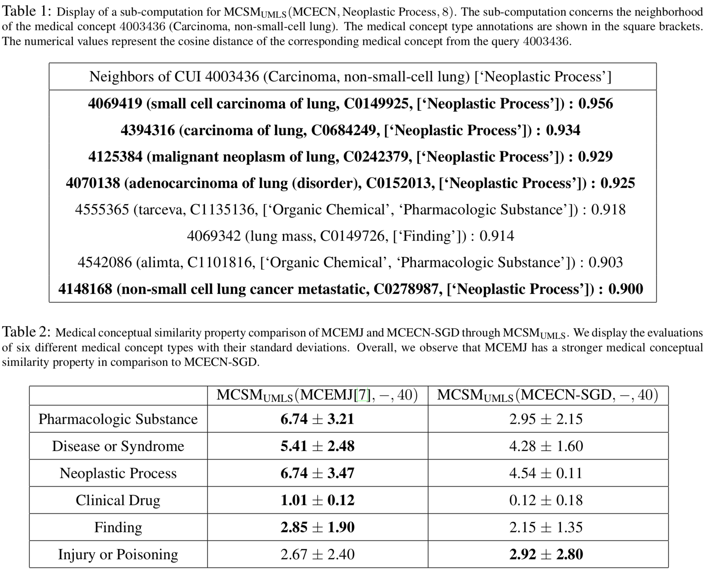
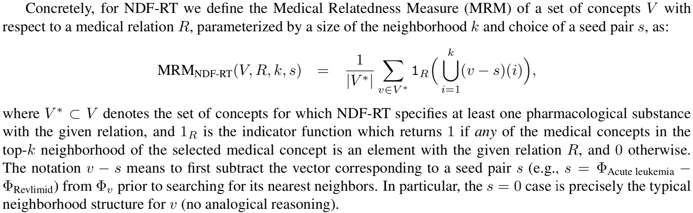
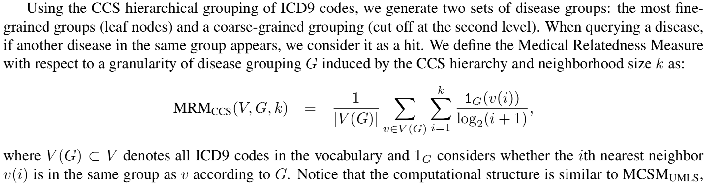
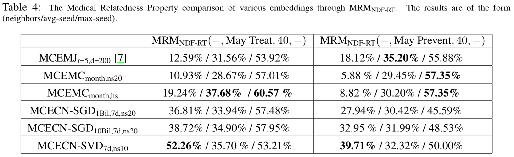

#Learning Low-Dimensional Representations of Medical Concepts
题目：学习医学概念的低维表示  
作者来自纽约大学，David Sontag（目前在MIT）实验室([site](http://clinicalml.org))。  

## 摘要
文章演示了如何学习多种医学概念的低维向量表示，这些概念包括了疾病、药物、治疗、实验室检查。
这些向量在医疗信息学的多个领域都有潜在的利用价值。
文章不仅仅从文本中学习词嵌入，还从医保账单中学习，此外，还使用了临床记述（Clinical Narratives）进行学习。
最终，作者建立了一个方法框架，来评估这些词嵌入的质量。
```text
We show how to learn low-dimensional representations (embeddings) of a wide range of concepts in medicine, 
including diseases (e.g., ICD9 codes), medications, procedures, and laboratory tests. 
We expect that these embeddings will be useful across medical informatics for tasks such as cohort selection and patient summarization. 
These embeddings are learned using a technique called neural language modeling from the natural language processing community. 
However, rather than learning the embeddings solely from text, 
we show how to learn the embeddings from claims data, 
which is widely available both to providers and to payers. 
We also show that with a simple algorithmic adjustment, 
it is possible to learn medical concept embeddings in a privacy preserving manner from co-occurrence counts derived from clinical narratives. 
Finally, we establish a methodological framework, 
arising from standard medical ontologies such as UMLS, NDF-RT, and CCS, 
to further investigate the embeddings and precisely characterize their quantitative properties.
```
## 1.概述
在医疗知识库/本体/分类体系中，存在着大量的概念。  
常见的有：
Unified Medical Language System (UMLS)：包括规范化的医学术语表。used as a means of standardizing the documentation of clinical concepts found in a patient’s electronic health record.  
LOINC(Logical Observation Identifiers Names and Codes):在美国被用于标识医学实验观察。    
International Classification of Diseases (ICD-9, ICD-10)：是国际通用的疾病、诊断分类体系  
NDC (National Drug Code)：在美国注册的所有人类药物的产品标识体系。 is a universal product identifier for human drugs in the US  
概念数量规模：
UMLS中有超过310万的概念，ICD-10-CM中包括了接近7万诊断编码，
ICD-10-PCS中包含7万procedure编码，LOINC编码有7万个，NDC编码有超过36万。  
由于概念体系的规模很大，概念体系中的层次结构可以很好的帮助完成查找特定概念以及相关概念的任务。
但是，层次结构收到自顶向下的结构的限制，虽然UMLS在概念之间存在大量的关系，
在概念之间进行映射（例如，找到与具有特定ICD9编码的疾病相关的、用于诊断或评估其发展程度的实验室检查的LOINC编码），
仍然是具有挑战性的工作。
在本文中，展示了如何学习医学概念的低维表示（也称作嵌入），将所有ICD9诊断和处理编码、
LOINC实验室编码、NDC药品编码置于一个公共的空间内。

论文所使用的方法是修改后的word2vec算法。
## 2.医学概念嵌入
论文中对比了三种医学概念嵌入，分别从医学期刊、医保账单以及临床记述中学习得到。

## 3.评估方法
为了系统地评价和对比三种嵌入，提出了两个抽象指标：医学概念相关度以及医学概念相似度。
### 3.1 医学概念相似度
医学概念相似度的定义如下：  
  
在上述定义基础上，医学概念相似度的计算示例及在医学期刊、临床记述嵌入中的对比如下表所示。
  

### 3.2 医学概念相关度
医学概念相关度的定义如下：
根据所使用的知识库的不同，医学概念相关度的计算分为两类，基于NDF-RT和基于CCS。
其中基于NDF-RT的计算方法定义如下：  
  
基于CCS的计算方法定义如下：
  
对比结果如下：
  
  