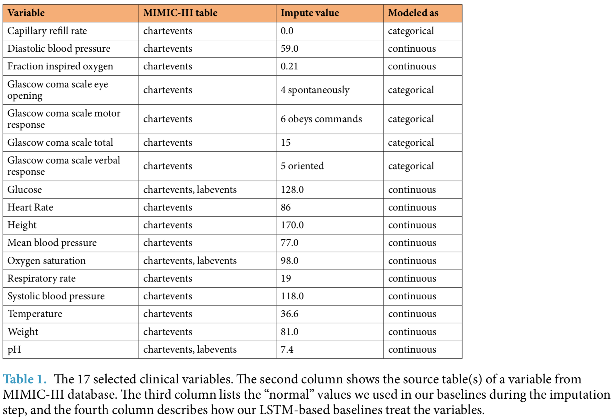
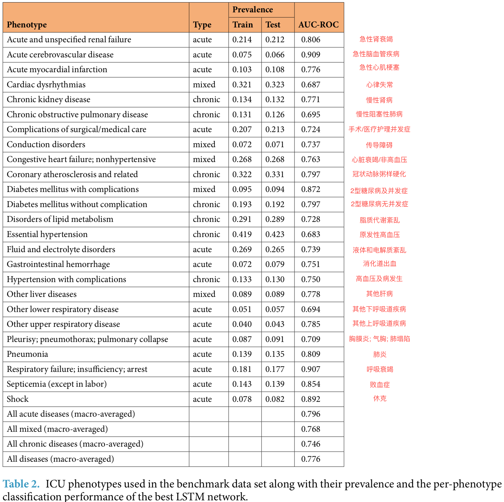
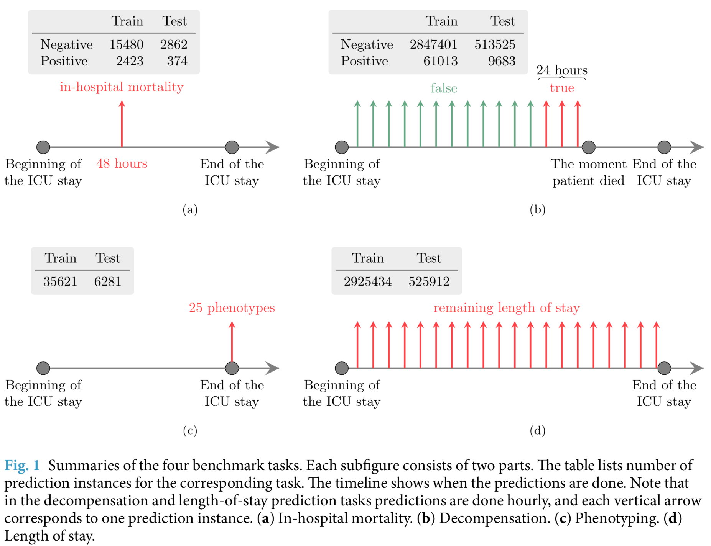
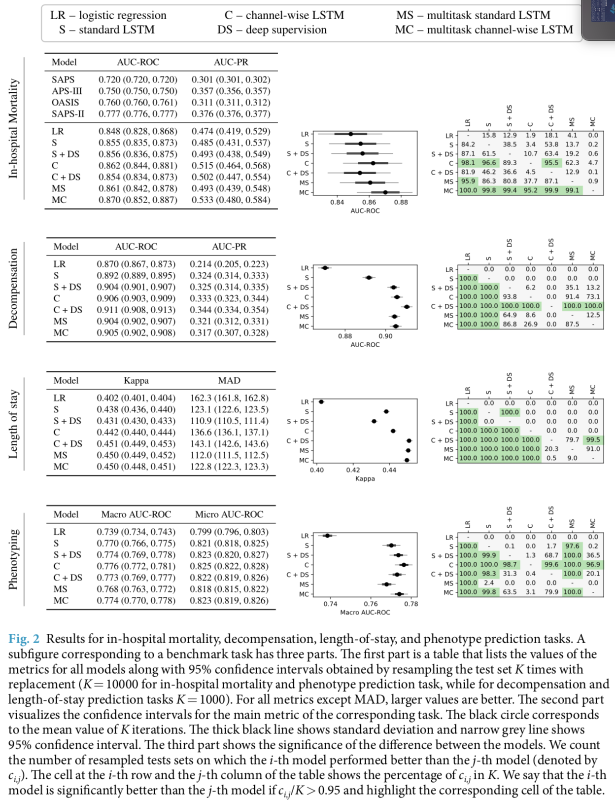

# Multitask learning and benchmarking with clinical time series data
临床时序数据上的多任务学习和基准测试

摘要：提出了四种临床预测基准测试任务，使用来自MIMIC-III数据集的公开数据。
这些任务涵盖了常见的临床问题，包括预测病人死亡风险，预测住院时长，
检测生理衰退以及症状分类等。文章为所有四个任务提出了很强的线性和神经基线模型，
评估了神经网络模型的性能表现。
```text
Health care is one of the most exciting frontiers in data mining and machine learning. 
Successful adoption of electronic health records (EHRs) created an explosion in digital clinical data available for analysis, 
but progress in machine learning for healthcare research has been difficult to measure because of the absence of publicly available benchmark data sets. 
To address this problem, we propose four clinical prediction benchmarks using data derived from 
the publicly available Medical Information Mart for Intensive Care (MIMIC-III) database. 
These tasks cover a range of clinical problems including modeling risk of mortality, 
forecasting length of stay, detecting physiologic decline, and phenotype classification. 
We propose strong linear and neural baselines for all four tasks and evaluate the effect of deep supervision, 
multitask training and data-specific architectural modifications on the performance of neural models.
```
## 1. 概述

虽然在医疗领域的机器学习研究正在稳步增长，但存在几个困难，减缓了利用数字化健康数据的进展。
```text
While there has been a steady growth in machine learning research for health care, 
several obstacles have slowed progress in harnessing digital health data.
```
1）首要挑战是缺乏广泛接受的基准测试任务来评价竞争模型。
```text
 The main challenge is the absence of widely accepted benchmarks to evaluate competing models.
```
2）大部分研究人员提出的新方法，一次只能解决一个临床预测任务。
```text
Additionally, most of the researchers develop new methods for one clinical prediction task at a time 
(e.g., mortality prediction12 or condition monitoring17). 
```
本文中，作者采用了一种综合的方法来解决上述挑战，提出了一个公开测试集，包含了四个不同的临床预测任务：
住院期间死亡率，physiologic decompensation，住院时长，以及症状的分类。
数据来源于MIMIC-III数据集，包括了4万个ICU住院记录以及针对四个任务的标签。
```text
In this paper, we take a comprehensive approach to addressing the above challenges. 
We propose a public benchmark suite that includes four different clinical prediction tasks 
inspired by the opportunities for “big clinical data” discussed in Bates et al.3
: in-hospital mortality, physiologic decompensation, length of stay (LOS), 
and phenotype classification. 
Derived from the publicly available Medical Information Mart for Intensive Care (MIMIC-III) database20,21, 
our benchmark contains rich multivariate time series from over 40,000 intensive care 
unit (ICU) stays as well as labels for four tasks spanning a range of classic machine learning problems 
from multilabel time series classification to regression with skewed responses. 
These data are suitable for research on topics as diverse as non-random missing data and time series analysis.
```
基准测试的建立，允许我们形式化描述涉及到联合学习所有四个预测任务的异构多任务学习问题。
而这些任务，在输出类型和时态结构上都有所不同。
文章使用了循环神经网络，利用了任务之间的相关性，改进了多个任务的性能。
代码[开源](https://github.com/YerevaNN/mimic3-benchmarks)
```text
This setup of benchmarks allows to formulate a heterogeneous multitask learning problem that involves jointly 
learning all four prediction tasks simultaneously. 
These tasks vary in not only output type but also temporal structure: 
LOS involves a regression at each time step, while in-hospital mortality risk is predicted once early in admission. 
Their heterogeneous nature requires a modeling solution that can not only handle sequence data 
but also model correlations between tasks distributed in time. 
We demonstrate that carefully designed recurrent neural networks are able to exploit these correlations 
to improve the performance for several tasks.
```

## 2. 结果

选用的数据集是MIMIC-III数据库的子集，包含超过3100万临床事件，对应于17个临床变量（见表1所示），
这些事件包括了33798名病人的42276次ICU住院。在这一数据集基础上，定义了四个评测任务。




* 1. In-hospital mortality prediction. 住院死亡率预测。
基于ICU住院期间前48小时的数据，预测住院期间的死亡率，属于二分类问题，使用AUC-ROC评价。

* 2. Decompensation prediction. 病情恶化预测。
预测病人的健康状况是否会在未来的24小时内快速恶化。这一任务的目标是替换目前在医院中使用的早期预警分数（early warning scores）。
由于缺乏评估早期预警分数的黄金标准，将这一任务定义为在ICU期间的每小时预测未来24小时内的死亡率。
与住院死亡率预测类似，也属于二分类问题，使用AUC-ROC评价。

* 3. Length-of-stay prediction. 住院时长预测。在ICU期间的每个小时，预测在ICU中停留的剩余事件。
将这一问题定义为一个多分类问题，包括少于1天，1天-7天的（7类），超过一周但少于两周，超过两周等在内的10个类/桶。
这一任务的评价方法为Cohen’s linear weighted kappa score.

* 4. Phenotype classification. 症状分类。25种急性症状的分类（见表格2）。这一问题是多标签分类问题，使用宏平均的AUC-ROC进行评价。



除上述任务外，还定义了多任务版本，各任务的概述见图1所示。



作者开发了线性回归模型和多个神经网络架构来执行评测任务。
实验的神经网络模型包括：基本/标准LSTM模型，channel-wise LSTM。
在这两种类型的LSTM上，都测试了deep supervision和多任务训练。
执行了超参数搜索来选择表现最好的模型，在测试集上评估了这些模型。
评估结果见图2所示。



实验结果显示，LSTM模型在所有任务的所有指标上都超越了线性模型。除任务1（入院死亡率）外，这种差距都很显著。  
实验结果也显示，channel-wise LSTMs和多任务训练在几乎所有的任务里都起到了正则化的效果。
Channel-wise LSTMs在所有的四个任务里都显著地超过了标准LSTM的效果，
多任务训练在除了phenotyping之外的所有任务中都有帮助，尤其是在任务2和任务3，效果显著。  
多任务训练在phenotyping任务中没有效果，作者猜测是因为phenotype分类本身就具有多任务的特性，
已经受益于在25个不同的症状中共享LSTM层的正则化效果，额外添加其他的任务，并计算加权损失，
可能会限制多任务LSTM的有效学习能力。  
将channel-wise层与多任务相结合也是有用的。
在入院死亡率预测和phenotyping任务中，多任务版本的channel-wise LSTMs比相对应的单任务模型表现显著好一些
（前面刚说了phenotyping任务中使用多任务学习无效，这里又提多任务表现好一些）。  
带有复制目标的Deep supervision对于入院死亡率没有帮助。
至于phenotyping，它对于标准LSTM有帮助，但对于channel-wise模型来说没有帮助。
另一方面，deep supervision在decompensation和length-of-stay预测任务中有显著的作用。  

## 3. 讨论
论文结果展示基于LSTM的模型显著的超越线性模型，但同时指出如果使用更加复杂的特征工程，也可以得到表现更好的线性模型。
论文也展示了使用channel-wise LSTMs以及学习使用单个神经模型来预测多个任务的优点，
结果显示，phenotyping和length-of-stay预测任务要更有挑战性，与死亡率和decompensation预测相比，需要更大的模型架构。
